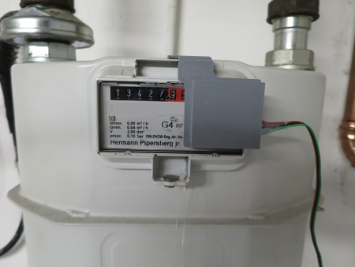
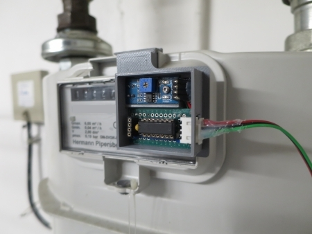
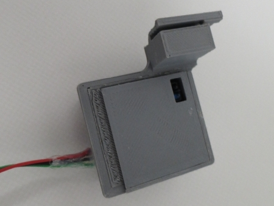
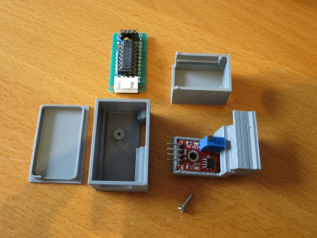
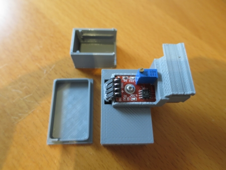
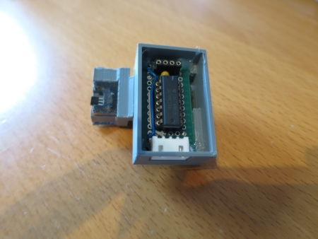
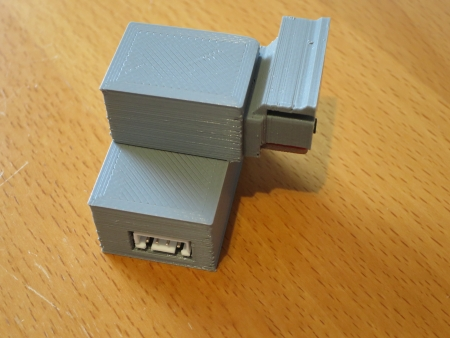
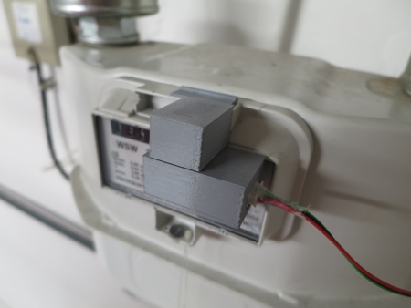

# WW-my3DP - Gehäuse für Breakout-Impulsgeber von Gas-, Wasser- und Stromzähler

[Zurück zur Übersicht ...](../README.md)

#### Beschreibung

Unterschiedliche 3D-Druck Gehäuse als <b>_einfache 'proof-of-concept' Lösungen_</b> für das Projekt ['Homematic Energiezähler für Gas, Wasser und Strom'](https://github.com/wolwin/WW-mySHP/blob/master/SHP_EZ_GWS/README.md)

#### STL-Dateien
- Gaszähler 'Pipersberg G4-RF1' mit:
  - 'TCRT5000-Breakout (KY-033)' - [Download ...](./bin/EZ-Gas_G4-RF1_TRCT5000_20230107.zip)
  -  'Hallgeber-Breakout (KY-024)' - [Download ...](./bin/EZ-Gas_G4-RF1_Hallgeber_20230107.zip)
    

- Wasserzähler 'elster de-08-mi001-ptb 019' mit:
  - 'LED-Breakout (KY-033)' - [Download ...](./bin/EZ-Wasser_LED_20230107.zip)
    

- Ferraris Tarifstromzähler 'Siemens Drehstromzähler' mit:
  - 'LED-Breakout (KY-033)' - [Download ...](./bin/EZ-Strom_LED_20230107.zip)

#### Bilder
- <b>Gaszähler 'Pipersberg G4-RF1' mit 'TCRT5000-Breakout (KY-033)'</b>
    
  
    
  
    
  
    

- <b>Gaszähler 'Pipersberg G4-RF1' mit 'Hallgeber-Breakout (KY-024)'</b>
    
  
    
  
    
  
    
  
    
  
    

- <b>Wasserzähler 'elster de-08-mi001-ptb 019' mit 'LED-Breakout (KY-033)'</b>
    
  '")
    
  '")
    
  '")
    
  '")
    
  '")
    
  '")
    
  '")
    
  '")
    
  '")

- <b>Ferraris Tarifstromzähler 'Siemens Drehstromzähler' mit 'LED-Breakout'</b>
    
  '")
    
  '")
    
  '")
    
  '")
    
  '")
    
  '")

#### Historie
- 2023-01-13 - Erstveröffentlichung
