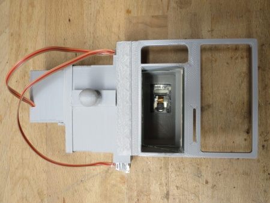

# WW-my3DP - Gehäuse für 'AI on the edge' Module für Gas-, Wasser- und Stromzähler

[Zurück zur Übersicht ...](../README.md)

### Beschreibung
Unterschiedliche 3D-Druck Gehäuse für das Projekt [''AI-on-the-edge-device' Energiezähler für Gas, Wasser und Strom im Homematic Umfeld'](https://github.com/wolwin/WW-mySHP/blob/master/SHP_EZ_GWS_AI/README.md)

### STL-Dateien
- ESP32 Modulhalter für 'AI on the edge' Gas-, Wasser- und Stromzähler:
    - 'AI on the edge' Modulhalter - [Download ...](./bin/EZ-AI_Strom_20230107.zip)
    

- Gaszähler 'Pipersberg G4-RF1' mit:
  - 'AI on the edge' mit Spiegel - [Download ...](./bin/EZ-AI_Gas_20230413.zip)
    

- Wasserzähler 'elster de-08-mi001-ptb 019' mit:
  - 'AI on the edge' DN75 - [Download ...](./bin/EZ-AI_Wasser_20230413.zip)
    

- Ferraris Tarifstromzähler 'Siemens Drehstromzähler' mit:
  - 'AI on the edge' mit Spiegel - [Download ...](./bin/EZ-AI_Strom_20230107.zip)
    

### Bilder
- <b>ESP32 Modulhalter</b>

  

  Im zugehörigen ZIP-Archiv sind ESP32 Gehäuse mit 27 mm und 32 mm Bauhöhe mit selbst einrastendem Deckel enthalten. Diese Gehäuse passen auf alle drei hier vorgestellten 'AI on the edge' 3D-Lösungen. Für eigene Kreationen liegt der Grundhalter als STL-Datei vor. Optional kann ein LED-Diffusor aus durchsichtigem Material (hier: PRUSA PETG klar) aufgesteckt werden.

  

  Natürlich muß vor dem endgültigen Einbau die Klebung am Linsenkörper entfernt / gelöst werden, um die Fokussierung möglich zu machen ([siehe Doku ...](https://jomjol.github.io/AI-on-the-edge-device-docs/Reference-Image/#focus)). Ein gutes Tool für die Einstellung des Focus das ['ESP32-CAM Focus tool'](https://www.thingiverse.com/thing:4844956) findet sich auf Thingiverse.

  Außerdem sollte die aktuelle Firmware auf den ESP32 aufgespielt werden und das Gerät im WLAN angemeldet und ansprechbar sein.

  Wenn später alles wie gewünscht funktioniert, und nichts mehr auseinandergenommen werden muß, sollte abschließend das ESP32 Modul mit mindestens zwei Heißklebepunkten fixiert werden - dabei darauf achten, dass das Modul plan im Gehäuse aufliegt.
    

- <b>Gaszähler 'Pipersberg G4-RF1'</b>

  Der ESP32 Modulgehäuse mit Diffusor und Deckel, sowie der Modulhalterdeckel für das Gaszählermodul.

  

  Der ESP32 Modulhalter wird in den Deckel des Gaszählermoduls eingeclipst.

  

  Das eigentliche Gehäuse besteht aus einen Tubus, der mit einem um 45 Grad abgewinkelten Spiegel das Bild des Zählerfeldes zur Kamera umlenkt. Es wurde ein IKEA LÖNSÅS Spiegel, 21x30 cm benutzt, der mit einem Glasschneider auf entsprechende Größe zurechtgeschnitten wurde. Fixiert wird der Spiegelausschnitt mit zwei Heißklebepunkten.

  

  Auf die beiden Nasen am Gehäusekörper wird der Halter für die Verbindung zum Gaszähler geschoben - dies geht stramm, um eine feste Verbindung sicherzustellen.

  

  Zuletzt wird der Deckel mit der Kamera auf den Gehäusekörper geclipst - auch hier ist neben dem strammen Sitz, auf die gleichmäßige und rechtwinklige Auflage des Deckel zu achten.

  

  Fertig montierte Gehäuseeinheit, die dann in die obere Halterungsöffnung des Gaszählers eingeclipst wird.

  

  Gaszähler 'Pipersberg G4-RF1' mit 'AI on the edge' Gerät.

  
    

- <b>Wasserzähler 'elster de-08-mi001-ptb 019'</b>

  Für Wasserzähler gibt es eine Vielzahl an 3D-Druckvorlagen - natürlich nicht für diese Wasseruhr. Also mußte ein neuer Entwurf her - dabei wurde das gleiche Konstruktionsprinzip, wie beim Originalentwurf benutzt. Eine Grundplatte, die sich 'spielfrei' mit einem Fixierring auf das Wasseruhrglas einlegen läßt, bildet dafür die Basis. Dabei greift die Aussparung im äußeren Ring unter die Deckelmechanik der Wasseruhr und bietet mit Befestigungsösen eine optimale Verbindung von Wasseruhr und Gehäuse.

  

  Ein auf ca. 9 cm (rechtwinklig !! ) gekürztes DN75 Abwasserrohr bildet die Verbindung zwischen Grundplatte und Deckel mit dem ESP32 Modul. Die Aussparung im Rohr ist so auszuführen, dass die konstruktiv vorgesehene Überlappung eine 'Lichtdichtheit' gewährleistet. Wenn die Aussparung passend gemacht ist, wird das Rohr rechtwinklig auf den Ring gepreßt - dafür evtl. vorgher die Ränder des DN75 Rohrs auf beiden Seiten entgraten und anfasen.

  

  Deckel des Wasserzähler-Gehäuses mit ESP32 Modulhalterung.

  

  Rechtwinklig aufgesetzter Deckel des Wasserzähler-Gehäuses mit ESP32 Modulhalterung - bitte beachten: für die optimale Ausrichtung muß der Deckel noch gedreht werden, um Reflexionen des Wasseruhrglases zu mindern.

  

  Eingeclipster ESP32 Modulhalter im Deckel des Wasserzähler-Gehäuses.

  

  Wasserzähler 'elster de-08-mi001-ptb 019' mit 'AI on the edge' Gerät.

  

  Auf dem Bild ist gut zu sehen, dass der Deckel mit dem ESP32 Modul fast um 90 Grad nach rechts verdreht werden mußte, um die LED Beleuchtungsreflexionen im Aufnahmebild der Kamera in einen Bereich zu verschieben, der bei der Bildauswertung nicht benutzt wird. Daher sollte man die Kabelbinder Befestigungen erst anschließend anbringen.

  Außerdem hat sich gezeigt, daß die Kunststoff-Kabelbinder ihre Ursprungsfixierkraft bedingt durch Feuchtigkeit und Temperaturunterschiede nicht halten können. Besser ist es, dünnen Draht mit Kunststoffummantelung zu benutzen - am besten noch gespannt durch die Zwischenschaltung einer Feder.
    

- <b>Ferraris Tarifstromzähler 'Siemens Drehstromzähler'</b>

  Da in dem Schaltschrank nur eine beschränkte Bauhöhe realisiert werden konnte, wurde der gleiche Ansatz wie bei dem 'AI on the edge' Gaszählergehäuse gewählt.
  Auch hier besteht das Gehäuse aus einen Tubus, der mit einem um 45 Grad abgewinkelten Spiegel das Bild des Zählerfeldes zur Kamera umlenkt. Es wurde ein IKEA LÖNSÅS Spiegel, 21x30 cm benutzt, der mit einem Glasschneider auf entsprechende Größe zurechtgeschnitten wurde. Fixiert wird der Spiegelausschnitt mit zwei Heißklebepunkten.

  

  Um eine 'gleichmäßige' Ausleuchtung zu erhalten, wurden seitlich zwei Gehäuse-Einschübe mit externen WS812B LEDs integriert ([siehe Doku ...](https://jomjol.github.io/AI-on-the-edge-device-docs/External-LED/)).

  Der Anschluß erfolgt über das ESP32 Modul, das in dem Modulhalter mit 32 mm Bauhöhe steckt - die Fixierung von ESP32 Modul und Bauteilen erfolgt auch hier über Heißklebepunkte.

  

  Wie bisher, sind alle 3D-Druckteile steckbar: der Tubuskörper wird starmm und bündig in den Halter gedrückt - gleiches gilt für die Kugelhalterung, die auf der Rückseite des Tubuskörpers aufzustecken ist. Zuletzt wird der ESP32 Modulhalterdeckel rechtwinklig auf den Tubus gesteckt.

  

  Ferraris Tarifstromzähler 'Siemens Drehstromzähler' mit 'AI on the edge' Gerät.

  

  Die Konstruktion wird vom [Small Ball Mounting System](https://www.thingiverse.com/thing:4632571) gehalten - die hier benötigten Teile sind im 3D-Druck Archiv für den Tarif-Stromzähler enthalten.
    

### Historie
- 2023-04-14 - Erstveröffentlichung
