# WW-my3DP - GARDENA EasyControl

[Zurück zur Übersicht ...](../README.md)

#### Beschreibung

Projekt 'HomeMatic_Gardena_Ventil' und GARDENA EasyControl

#### Bilder
- Übersicht - Konstruktion
  
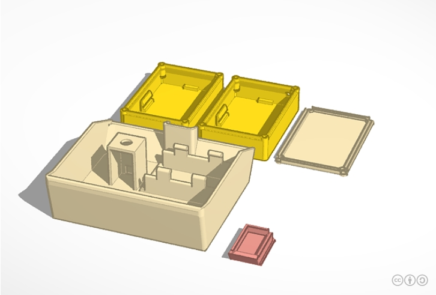
  
- Übersicht - Zusammenbau
  
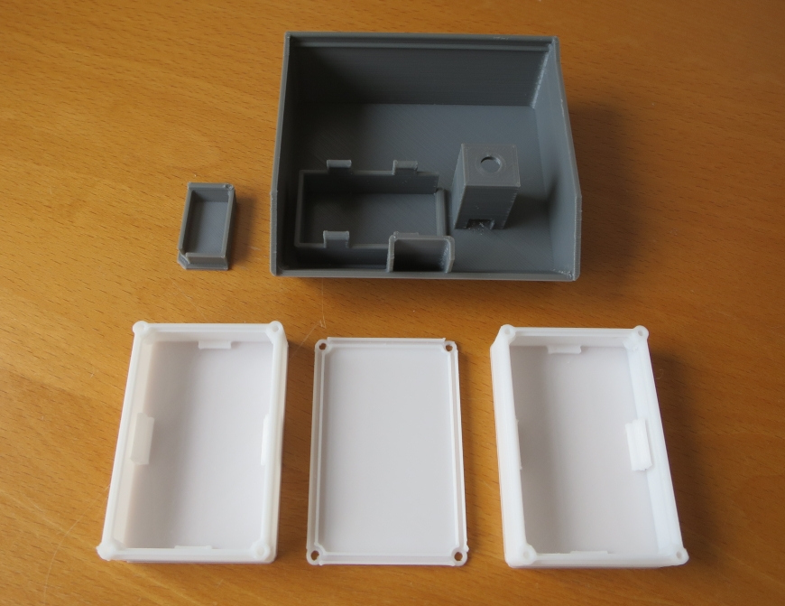
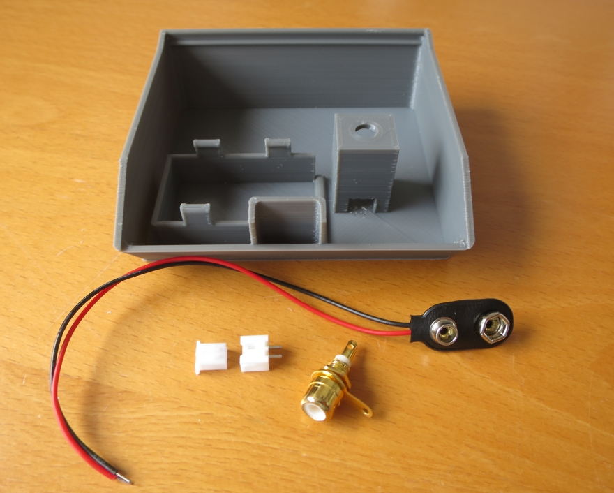
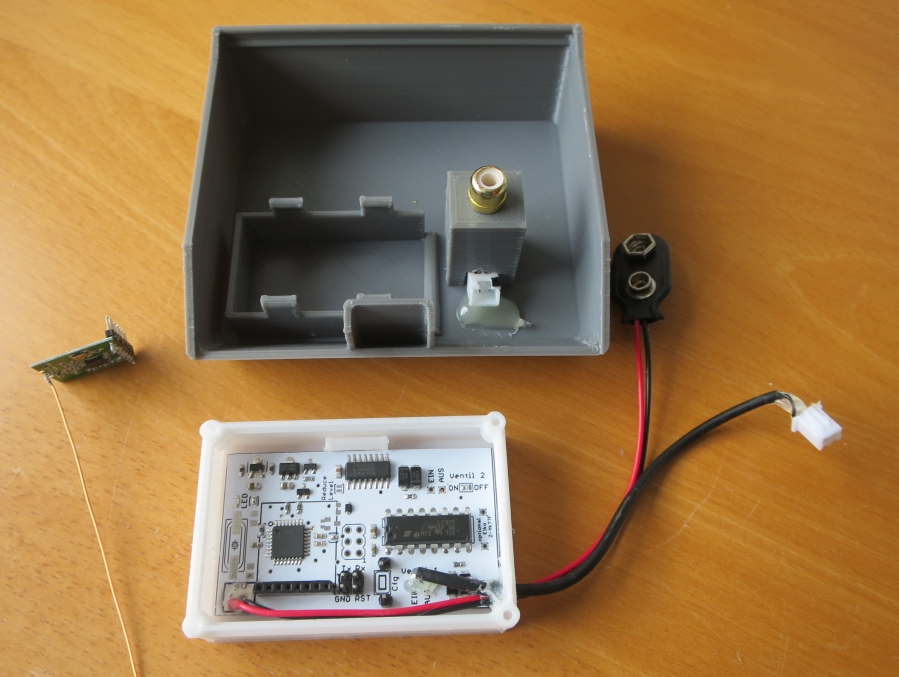
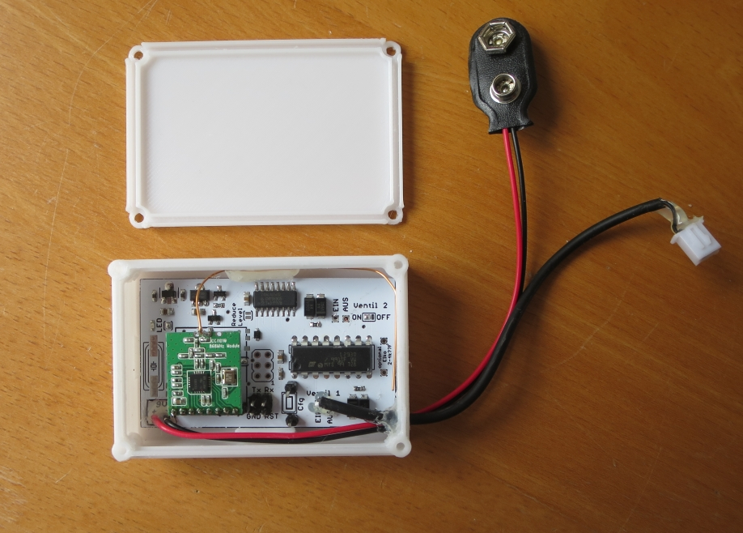
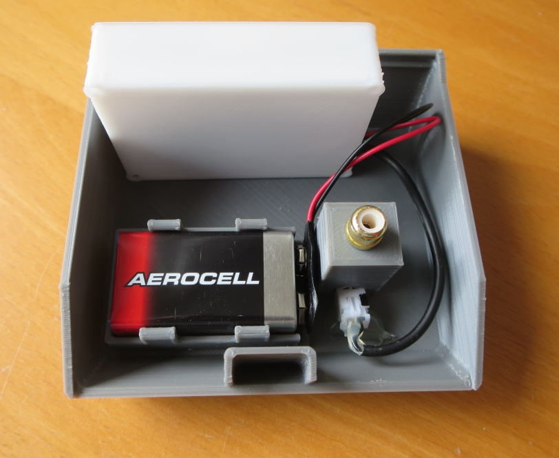
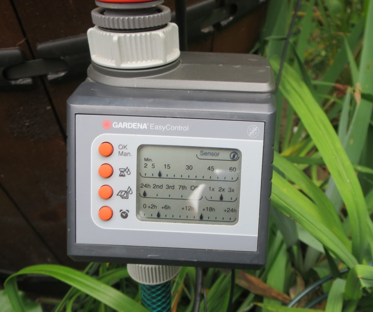
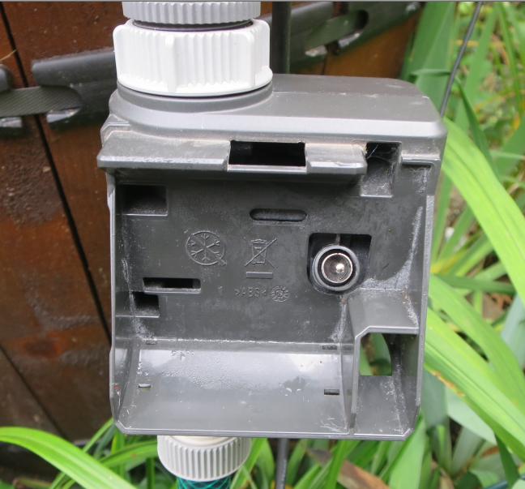
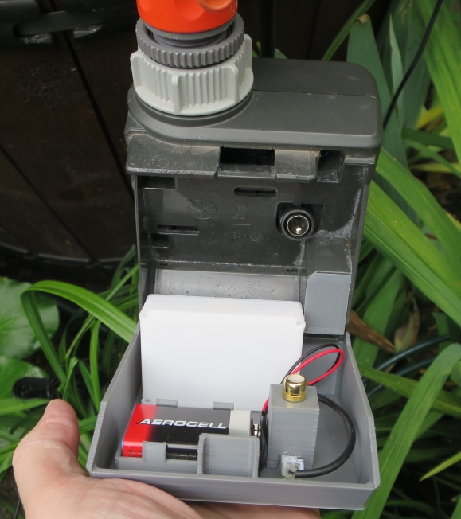
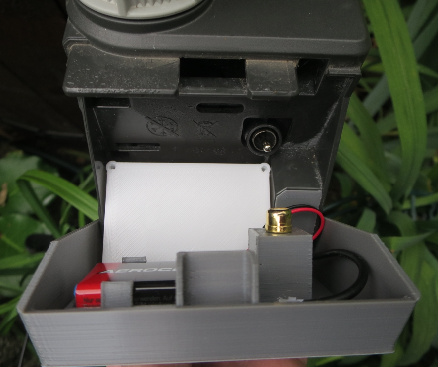
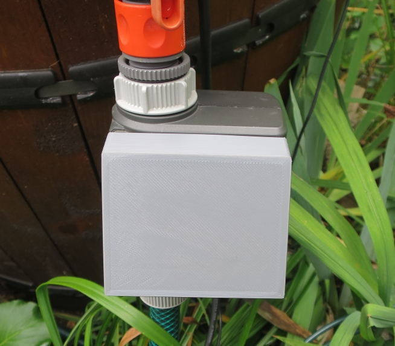

#### Historie
- 2020-01-10 - Erstveröffentlichung
  - Version 1.0 - 12-2019
