# WW-my3DP - HB‑Dis‑WM55‑Pb

[Zurück zur Übersicht ...](../README.md)

#### Beschreibung

Gehäuse für das Projekt 'HB‑Dis‑WM55‑Pb - Erweiterung der Homematic 'Funk-Statusanzeige HM-Dis-WM55' zur externen zusätzlichen Ansteuerung der Anzeige-Tasten'.
  
[Projekt zeigen ...](https://github.com/wolwin/WW-mySHP/blob/master/SHP_HB‑Dis‑WM55‑Pb/README.md)

Das Gehäuse kann auch für andere Homematic Module mit 50x50 mm Einsätzen genutzt werden.
  
Der Entwurf basiert auf dieser Thingiverse Veröffentlichung:
['Homematic Table / Desk Stand Tischaufsteller' by conny_g January 13, 2018](https://www.thingiverse.com/thing:2755553)

#### STL-Dateien
- [Download ...](./bin/3DP_STL_HB-Dis-WM55-Pb_20200911.zip)
  
- Für den Zusammenbau der 3D-Druckteile werden folgende Schrauben benötigt:
  - 'Blechschrauben DIN 7981 TX Edelstahl VA Linsenkopf 2,2 x 6,5 mm'
  - 'Blechschrauben DIN 7981 TX Edelstahl VA Linsenkopf 2,2 x 9,5 mm'
  | **Anzahl** | **Schrauben** | **Bezeichnung** |
  | --- | --- | --- |
  | 4 | 2,2 x 6,5 | Homematic-Systemhalter |
  | 2 | 2,2 x 9,5 | Modulhalter für Zusatzplatine |
  | 4 | 2,2 x 6,5 | Befestigung Platine auf Modulhalter |
  | 1 | 2,2 x 9,5 | Batteriehalter |
  | 4 | 2,2 x 6,5 | Rückwand Deckel |

#### Thingiverse
- [Thing xxx ...](https://www.thingiverse.com/thing:xxx)

#### Bilder
- Übersicht - Konstruktion
  - Gehäuse für 3-fach AAA- bzw. AA-Batteriehalter - links flache Rückwand (keine interne Erweiterung möglich) - rechts mit tiefer Rückwand (interne Erweiterung möglich).
      
    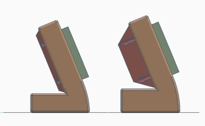
      
    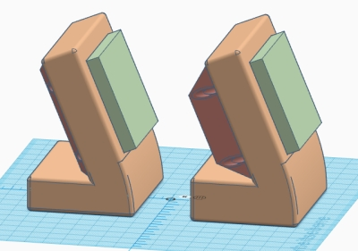
      
- Gehäuse für 3-fach AA-Batteriehalter mit tiefer Rückwand
    
  - Rückansicht.
      
    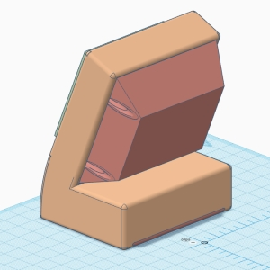
      
  - Rückansicht mit Durchsicht auf Einbau-Komponenten.
      
    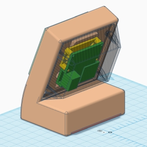
      
  - Durchsicht auf Modulhalter mit 'HB-Dis-WM55-Pb 1.1' Platine.
      
    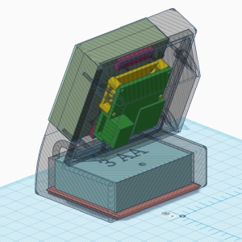
      
  - Seitliche Durchsicht auf alle Komponenten.
      
    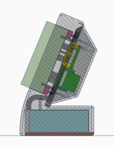
      
- Gehäuse Varianten für unterschiedliche Platinen.
    
  
    
  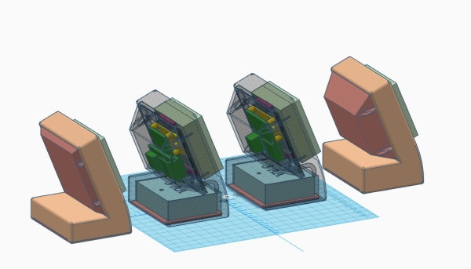
    
- Leergehäuse vor dem Zusammenbau.
    
  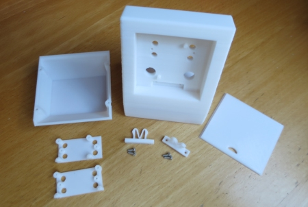
    
- Seitliche Ansicht Gehäuse für 3-fach AA-Batteriehalter mit tiefer Rückwand.
    
  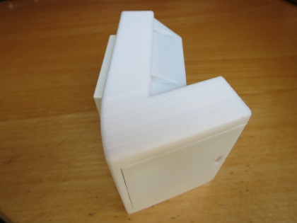
    
- Seitliche Ansicht Gehäuse für 3-fach AA-Batteriehalter mit flacher Rückwand.
    
  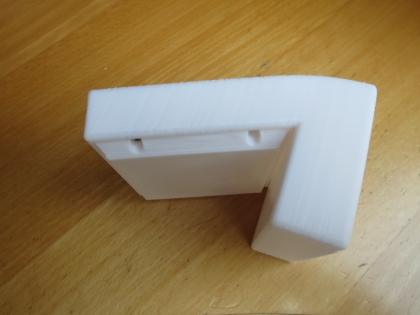
    
- Ansicht Gehäuse für 3-fach AA-Batteriehalter mit Homematic 'HM-Dis-WM55' Modul und 'HB-Dis-WM55-Pb' Erweiterung.
    
  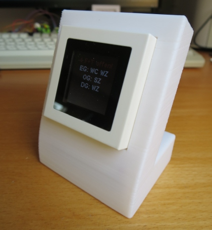
    

#### Historie
- 2020-10-07 - Erstveröffentlichung
