# WW-my3DP - HB-LC-Bl1-Velux

[Zurück zur Übersicht ... ](../README.md)

### Beschreibung
Gehäuse für das Projekt 'HB-LC-Bl1-Velux - Velux KLI 310 Integration in HomeMatic zur Steuerung von Velux Rolladen'
  
[Projekt zeigen ...](https://github.com/wolwin/WW-mySHP/blob/master/SHP_HB-LC-BL1-Velux-KLI310/README.md)

### STL-Dateien
- [Download ...](./bin/3DP_STL_Velux-KLI310_20200724.zip)

### Thingiverse
- [Thing 4552342 ...](https://www.thingiverse.com/thing:4552342)

### Bilder
- Übersicht - Konstruktion
  
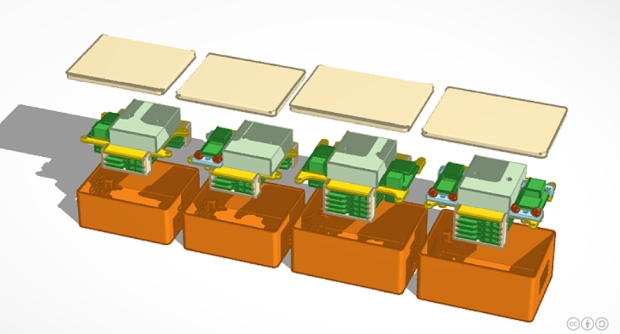
  
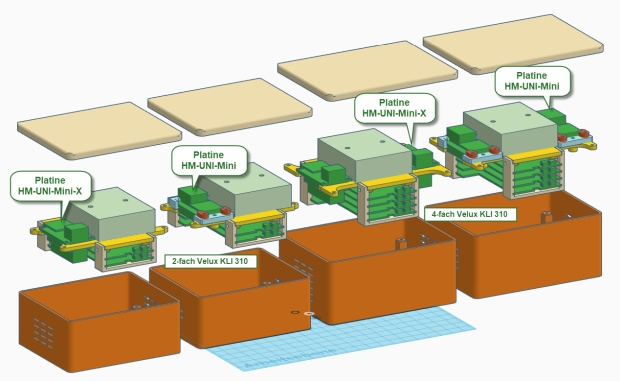
  
- Übersicht - schematischer Zusammenbau für bis zu zwei 'Velux KLI 310' Platinen und einem (hier: batteriebetriebenen) 'Asksin++ Modul': minimale Funktion mit 'HB-UNI-Mini' Platine, maximale Funktion mit 'HB-UNI-Mini-X' und 'HB-UNI-Mini-X AddOn' Platinen
  
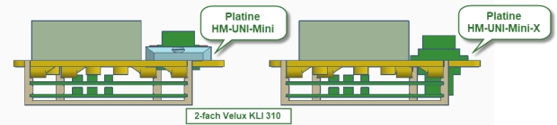
  
- Übersicht - schematischer Zusammenbau für bis zu vier 'Velux KLI 310' Platinen und bis zu zwei (hier: batteriebetriebnen) 'Asksin++ Modulen': minimale Funktion mit 'HB-UNI-Mini' Platine, maximale Funktion mit 'HB-UNI-Mini-X' und 'HB-UNI-Mini-X AddOn' Platinen
  
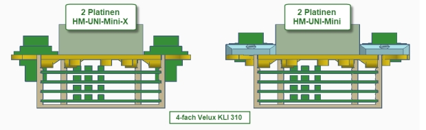
  
- Übersicht - 2-fach bzw. 4-fach Platinenhalter für 'Velux KLI 310'-Modul mit vier 'Blechschrauben DIN 7981 TX Edelstahl VA Linsenkopf 2,2 x 6,5 mm' zur Befestigung an der Modul-Trägerplatte
  
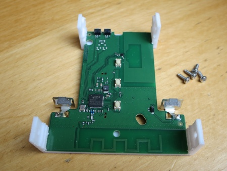
  
- Übersicht - Minimal-Konfiguration: Träger mit Platine 'HB-UNI-Mini' und bis zu zwei 'Velux KLI 310'-Modulen mit zweifach AA-Batteriehalter. Zur Platinen- und Batteriehalterbefestigung werden vier 'Blechschrauben DIN 7981 TX Edelstahl VA Linsenkopf 2,2 x 6,5 mm' und zwei 'Blechschrauben DIN 7981 TX Edelstahl VA Linsenkopf 2,2 x 9,5 mm' benötigt.
  
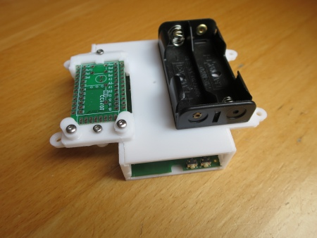
  
- Übersicht - Minimal-Konfiguration: Träger mit Platine 'HB-UNI-Mini' im Gehäuse. Der Modulträger wird mit vier 'Blechschrauben DIN 7981 TX Edelstahl VA Linsenkopf 2,9 x 9,5 mm' im Gehäuse verschraubt.
  
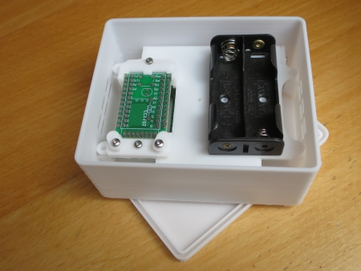
  
- Übersicht - Maximal-Konfiguration: Träger mit Platine 'HB-UNI-Mini-X' und bis zu zwei 'Velux KLI 310'-Modulen mit dreifach AA-Batteriehalter. Zur Platinen- und Batteriehalterbefestigung werden sechs 'Blechschrauben DIN 7981 TX Edelstahl VA Linsenkopf 2,2 x 6,5 mm' benötigt.
  
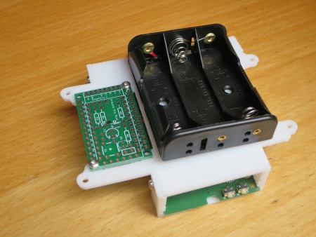
  
- Übersicht - Maximal-Konfiguration: Träger mit Platine 'HB-UNI-Mini-X' im Gehäuse. Der Modulträger wird mit vier 'Blechschrauben DIN 7981 TX Edelstahl VA Linsenkopf 2,9 x 9,5 mm' im Gehäuse verschraubt.
  
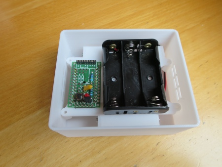
  
- Übersicht - Maximal-Konfiguration: Mit den Platinen 'HB-UNI-Mini-X' und 'HB-UNI-Mini-X AddOn' kann auch eine 9V Blockbatterie oder eine externe Spannungsquelle von 4-12 Volt eingesetzt werden.
  
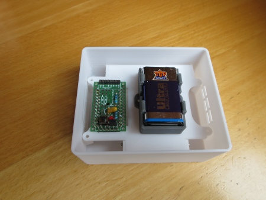
  
- Übersicht - Gehäuse (klein) mit Deckel: Das Gehäuse kann ohne, mit zwei oder mit vier seitlichen Lüftungsschlitzen gedruckt werden - ein einfach einrastender Deckel verschließt das Gehäuse.
  
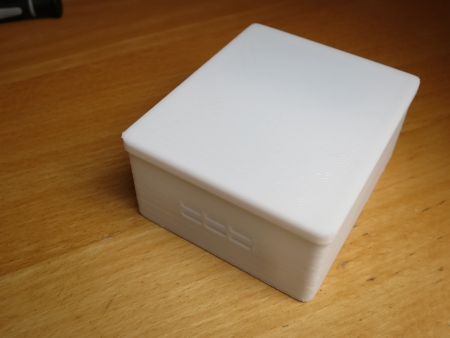
  
- Übersicht - Minimal-Konfiguration: Träger mit zwei Platinen 'HB-UNI-Mini' und bis zu vier 'Velux KLI 310'-Modulen mit zweifach AA-Batteriehalter. Zur Platinen- und Batteriehalterbefestigung werden sechs 'Blechschrauben DIN 7981 TX Edelstahl VA Linsenkopf 2,2 x 6,5 mm' und vier 'Blechschrauben DIN 7981 TX Edelstahl VA Linsenkopf 2,2 x 9,5 mm' benötigt.
  
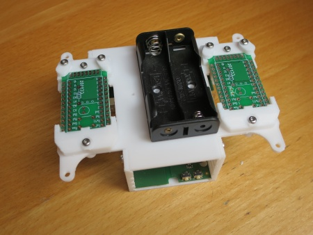
  
- Übersicht - Minimal-Konfiguration: Träger mit zwei Platinen 'HB-UNI-Mini' im Gehäuse. Der Modulträger wird mit vier 'Blechschrauben DIN 7981 TX Edelstahl VA Linsenkopf 2,9 x 9,5 mm' im Gehäuse verschraubt.
  
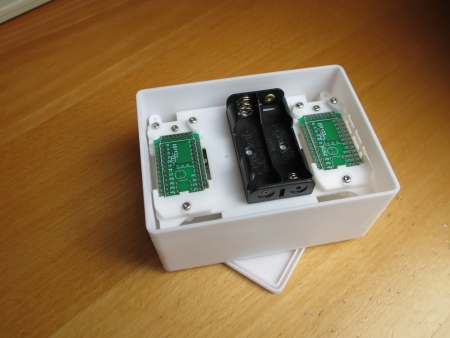
  
- Übersicht - Maximal-Konfiguration: Träger mit zwei Platinen 'HB-UNI-Mini-X' und bis zu vier 'Velux KLI 310'-Modul mit dreifach AA-Batteriehalter. Zur Platinen- und Batteriehalterbefestigung werden zehn 'Blechschrauben DIN 7981 TX Edelstahl VA Linsenkopf 2,2 x 6,5 mm' benötigt.
  
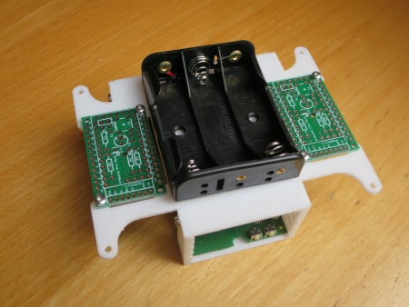
  
- Übersicht - Maximal-Konfiguration: Träger mit zwei Platinen 'HB-UNI-Mini-X' im Gehäuse. Der Modulträger wird mit vier 'Blechschrauben DIN 7981 TX Edelstahl VA Linsenkopf 2,9 x 9,5 mm' im Gehäuse verschraubt.
  
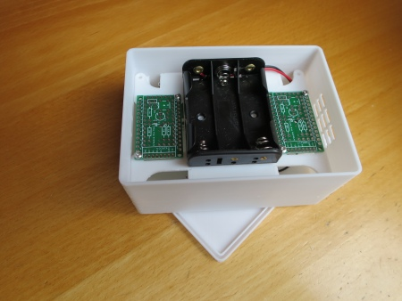
  
- Übersicht - Gehäuse (groß) mit Deckel: Das Gehäuse kann ohne, mit vier oder mit sechs seitlichen Lüftungsschlitzen gedruckt werden - ein einfach einrastender Deckel verschließt das Gehäuse.
  
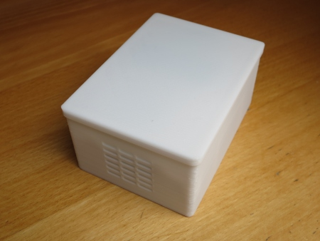
  

### Historie
- 2020-07-24 - Erstveröffentlichung
