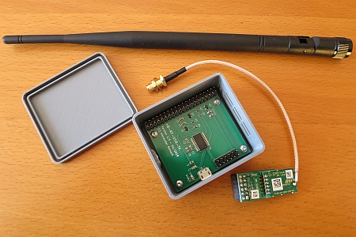

# WW-my3DP - HB-RF-USB-TK mit RPI-RF-MOD

[Zurück zur Übersicht ... ](../README.md)

### Beschreibung
Gehäuse für die Platine 'HB-RF-USB-TK' von Alexander Reinert mit dem Homematic Funkmodul 'RPI-RF-MOD' und externer Antenne zum Betrieb von funkgebundenen Homematic Geräten.
  
[Projekt zeigen ...](https://github.com/alexreinert/PCB#hb-rf-usb)

### STL-Dateien
- [Download ...](./bin/3DP_STL_HB-RF-USB-TK_20210215.zip)

### Thingiverse
- [Thing 4763356 ...](https://www.thingiverse.com/thing:4763356)

### Bilder
- Übersicht - Konstruktion
  

  
- Teile-Übersicht
  

  
  - Eightwood 868 MHz Antenne Kipp-und-Schwenkbar NFC RFID Antenne RP-SMA Stecker + RP-SMA Buchse Pigtail Kabel RG178 15cm 6inch für GSM Wireless WiFi
  - Platine 'RPI-RF-MOD'
  - Platine ' HB-RF-USB-TK'
  - vier 'Blechschrauben DIN 7981 TX Edelstahl VA Linsenkopf 2,2 x 6,5 mm' zur Befestigung an der Modul-Trägerplatte
  - Gehäuse (hier: mit Hinterwandlochung)
  
- Platinen Einbau
    

  
- Fertiges Gerät
  

  
  - Ferritkern aus dem Bausasatz 'RPI-RF-MOD' (vierfach umwickeltes USB-Kabel)
  - Amazon Basics 7A82V4 Verbindungskabel, USB 2.0, USB-A-Stecker auf Micro-USB-B-Stecker 0,9 m
  

### Historie
- 2021-02-15 - Erstveröffentlichung
