# WW-my3DP - HB-UNI-Sen-CAP-MOIST

[Zurück zur Übersicht ...](../README.md)

#### Beschreibung

Gehäuse für das Projekt 'HB-UNI-Sen-CAP-MOIST - Kapazitiver Bodenfeuchtesensor mit optionalem Temperatursensor DS18B20 für die Integration in HomeMatic'
  
[Projekt zeigen ...](https://github.com/wolwin/WW-mySHP/blob/master/SHP_HB-UNI-Sen-CAP-MOIST/README.md)

#### STL-Dateien
- [Download ...](./bin/3DP_STL_HB-UNI-Sen-CAP-MOIST_20200204.zip)

#### Thingiverse
- [Thing 4147410 ...](https://www.thingiverse.com/thing:4147410)

#### Bilder
- Übersicht - Konstruktionen
  
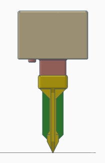
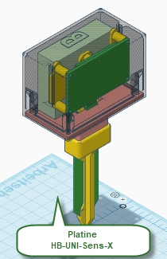
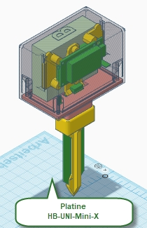

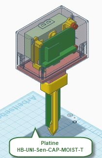
  
- Übersicht - schematischer Zusammenbau
  
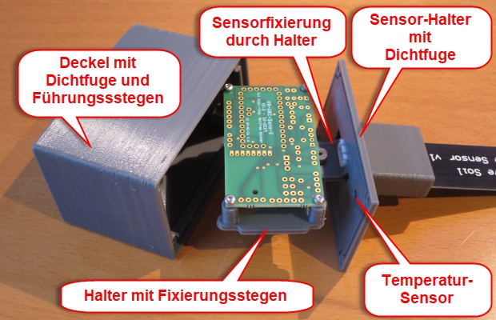
  
- Übersicht - Halter für 2-fach bzw. 3-fach AA-Batterien und unterschiedliche HomeBrew Platinen: 'HB-UNI-Sens-X', 'HB-UNI-Mini-X', 'HM-UNI-Mini' und 'HB-UNI-Sen-CAP-MOIST-T' (ungetestet) - zur Befestigung werden 'Blechschrauben DIN 7981 TX Edelstahl VA Linsenkopf 2,2 x 6,5 mm' benutzt
  
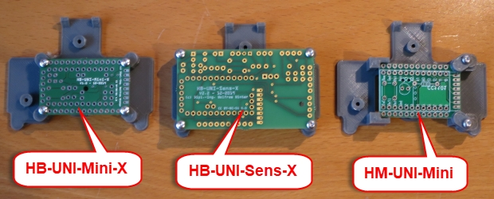
  
- Übersicht - fertig aufgebaute und getestete Moduleinheiten - die Anmeldung an der CCU Zentrale sollte erfolgreich durchgeführt sein
  
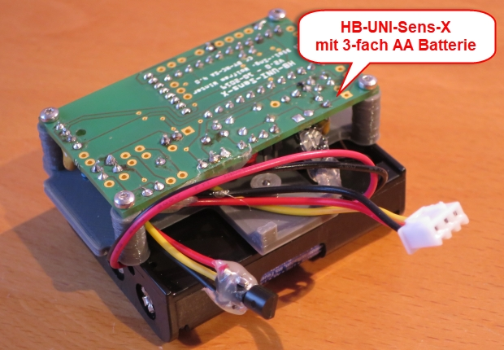
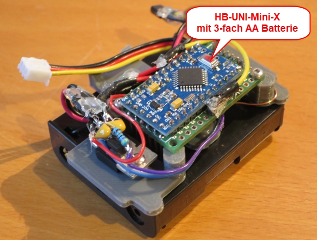
  
- Übersicht - Einfügen der Moduleinheit in den Deckel - Stege der Moduleinheit in die Führungsstege des Deckels einführen
  
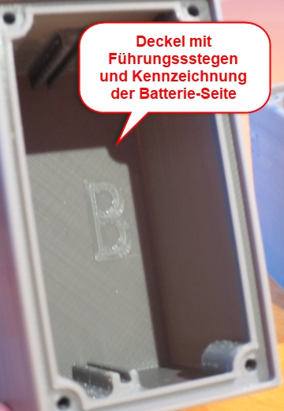
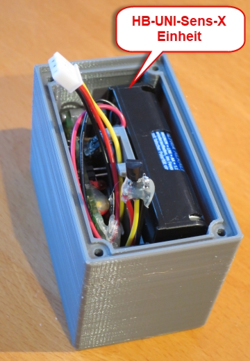
  
- Natürlich sollten alle 3D-Druckteile mit einem UV-beständigen Acryl-Lack überzogen werden. Man kann natürlich Sprühlack einsetzen - aber: im Innenbereich nicht einsetzbar !! Gute Erfahrungen habe ich mit lösungsmittelfreien Streichlack gemacht - läßt sich mit einem kleinen Pinsel super verarbeiten ... und riecht (fast) nicht:
  
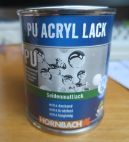 RAL 7016 - Anthrazitgrau
  
- Übersicht - Zusammenbau
   - zuerst sollte der Feuchtigkeitssensor mit UV-beständigem Silikon in den Sensorhalter eingesetzt und abgedichtet werden (24 h durchtroknen lassen)
   - dann können die drei Teile (Deckel, Modul, Halter) zusammengefügt werden - dabei auch den Temperatursensor in die Aussparung im Sensorhalter drücken (soll stramm reingehen - evtl. Öffnung leicht mit Feile weiten)
   - es ist darauf zu achten, dass der Modulhalter korrekt in die Aussparung des Sensorhalters eingreift (Deckel und Moduleinheit fixieren damit den Sensor in der Verikalen) !!!
   - die Dichtfugen von Deckel bzw. Sensorhalter können beim Zusammenbau ebenfalls LEICHT mit Silikon versehen werden
   - das ganze wird mit vier 'Blechschrauben DIN 7981 TX Edelstahl VA Linsenkopf 2,9 x 9,5 mm' verschraubt
   - wahlweise kann zum Schutz des Feuchtigkeitssensors noch ein 4 oder 6 mm Erdspieß aufgesteckt werden
  
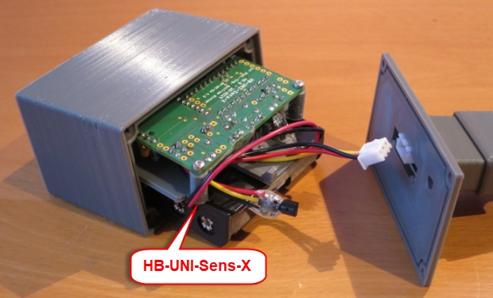
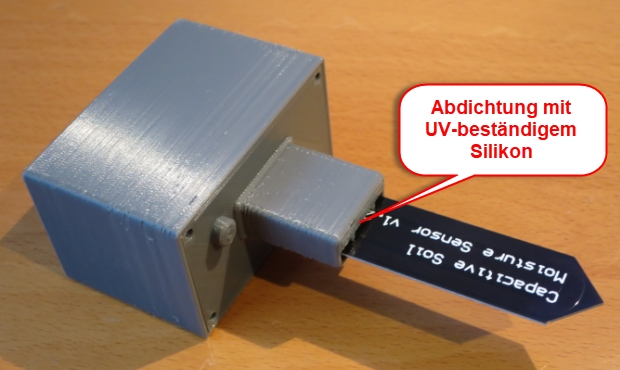
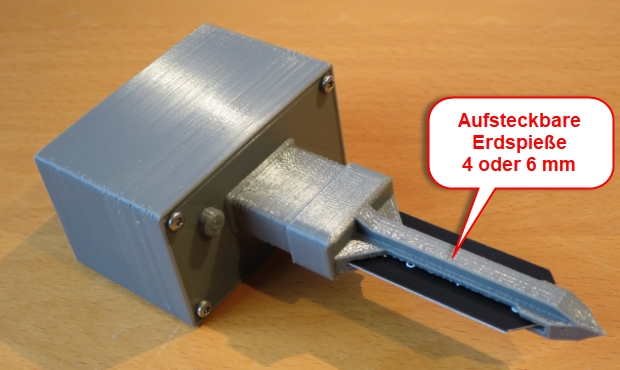

#### Historie
- 2020-02-04 - Erstveröffentlichung
  - Version 1.0 - 02-2020
