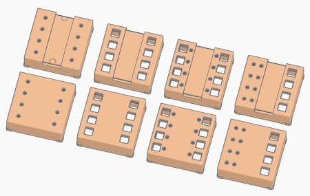

# WW-my3DP - HM-WM55_HM-MOD-Re-8

[Zurück zur Übersicht ...](../README.md)

### Beschreibung
Unterschiedliche 3D-Druck Aufsatz-Module zum Aufbau eines Homematic WM55-Gehäuses für das Homematic 8-Kanal-Empfangsmodul 'HM-MOD-Re-8'. Es handelt sich dabei um eine Modifikation bzw. Erweiterung des ['3D-Druck Projekt für 'HM-WM55-Module'](https://github.com/wolwin/WW-my3DP/blob/master/3DP_HM-WM55_HM-Module/README.md).
  
Details des Zusammenbaus siehe auch unter: [Projekt 'HM-WM55_HM-MOD-Re-8'](https://github.com/wolwin/WW-mySHP/blob/master/SHP_HM-WM55_HM-MOD-Re-8/README.md)

_Anmerkung:_ 
Das 3D-Druck Gehäuse sollte farblich zu der Schaltereinheit 'GIRA System Standard 55 reinweiß glänzend' (ähnl. RAL 9010) passen. Da jedoch die meisten weißen Filamente ohne eine RAL-Angabe angeboten werden, habe ich (zufällig) das 'PRUSA - Weisses PLA Filament 1Kg' ausgewählt. Der GIRA Farbton der Schaltereinheit wird ganz gut getroffen. Jedoch erfordert das gewählte Filament erhöhte Aufmerksamkeit bei der Drucker-Konfiguration und der Ausgabe der Druckobjekte, da es äußerst empfindlich bei den ersten Druckschichten reagiert. Im STL-Download-Archiv sind die notwendigen Druckeinstellungen hinterlegt - realisiert wurde das Objekt 'HM-WM55_MOD-Rx-8_BTN-4_LED-8_Label_Top.stl'.

Damit das PLA-Gehäuse geschützt ist, wurde es nach dem Ausdruck und der Feinbehandlung dünn mit klarem Acryllack (seidenmatt) bestrichen.

- Filament:
  - Prusa - Weisses PLA Filament 1Kg
  - Prusa - Prusament PETG Clear 1Kg
  
- Gedruckt wurde mit 'CURA 14.13.1' auf einem 'Prusa MK3S' Drucker.

### STL-Dateien
- [Download ...](./bin/3DP_STL_HM-WM55_MOD-Rx-8_20220627.zip)
  
- Es werden folgende Batterie-Kontakte benötigt:
  - [Batteriekontakt Plus für 55er Aufputzgehäuse](https://de.elv.com/batteriekontakt-plus-fuer-55er-aufputzgehaeuse-lr03-098647)
  - [Batteriekontakt Minus für 55er Aufputzgehäuse](https://de.elv.com/batteriekontakt-minus-fuer-55er-aufputzgehaeuse-lr03-098648)
  
- Für das Label wird eine Folienabdeckung empfohlen:
  - [Folie aus Polycarbonat klar 1000 x 600 x 0,5 mm](https://www.amazon.de/gp/product/B09D9RKPYK/ref=ppx_yo_dt_b_asin_image_o04_s00?ie=UTF8&psc=1)

### Thingiverse
- [Thing 5491839 ...](https://www.thingiverse.com/thing:5491839)

### Bilder
- Übersicht - Konstruktion
    
  - Basis-Modul mit zwei AAA-Batterieaufnahmen und Clip-Aufsatzbefestigung für [Projekt 'HM-WM55_HM-MOD-Re-8'](https://github.com/wolwin/WW-mySHP/blob/master/SHP_HM-WM55_HM-MOD-Re-8/README.md)
    
  
    
  - Verschiedene Aufsatz-Module in der Kombination von 'Taster / LED / Label' Anordnung
    
  
    
  - Konstruktive Ansicht 4-fach Taster / 8-fach LED Aufsatz-Modul mit Label-Aussparung
    
  
    
  - Konstruktive Gesamtansicht 4-fach Taster / 8-fach LED  mit Label
    
  
    
  - 3D-Druck des Basis- und des Aufsatz-Moduls
    
  
    
  - 3D-Druck des Label-Halters und der Tastenknöpfe (transparentes Filament)
    
  
    
  - Zusammengesetzter 3D-Druck von Aufsatz-Modul, Label-Halter und Tasten
    
  
    

### Historie
- 2022-08-29 - Erstveröffentlichung
