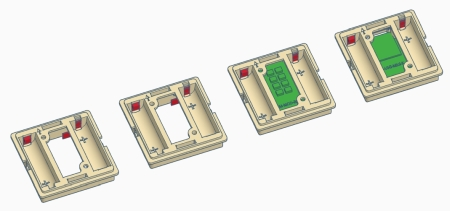

# WW-my3DP - HM-WM55_HM-Module

[Zurück zur Übersicht ...](../README.md)

#### Beschreibung

Unterschiedliche 3D-Druck Module zum Aufbau eines Homematic WM55-Gehäuses. Die Vorlagen können als Basis für eigene Entwicklungen dienen: siehe dazu auch: [Projekt 'HM-WM55_HM-MOD-Re-8'](https://github.com/wolwin/WW-mySHP/blob/master/SHP_HM-WM55_HM-MOD-Re-8/README.md)

#### STL-Dateien
- Ersatz-Montageplatte für 55er Homematic-Geräte - [Download ...](./bin/3DP_STL_HM-WM55_Holder_20220721.zip)
    
  - Kann auch hier im Original bezogen werden (ELV):
    - [Homematic Montageplatte für Wandmontage auf DIN-UP-Dose](https://de.elv.com/homematic-montageplatte-fuer-wandmontage-auf-din-up-dose-ral7035-098646?fs=2412447686)
    
- Basis-Modul mit zwei AA-Batterieaufnahmen - [Download ...](./bin/3DP_STL_HM-WM55_Body_20220721.zip)
    
  - Es werden folgende Batterie-Kontakte benötigt (ELV):
    - [Batteriekontakt Plus für 55er Aufputzgehäuse](https://de.elv.com/batteriekontakt-plus-fuer-55er-aufputzgehaeuse-lr03-098647)
    - [Batteriekontakt Minus für 55er Aufputzgehäuse](https://de.elv.com/batteriekontakt-minus-fuer-55er-aufputzgehaeuse-lr03-098648)
    
- Wippe für vorhandene Homematic WM55 Platinen - [Download ...](./bin/3DP_STL_HM-WM55_Rocker_20210423.zip)

#### Thingiverse
- [Thing 5490797 ...](https://www.thingiverse.com/thing:5490797)
- [Thing 4866261 ...](https://www.thingiverse.com/thing:4866261)

#### Bilder
- Übersicht - Konstruktion
    
  - Ersatz-Montageplatte für 55er Homematic-Geräte.
    
  
    
  - Basis-Modul mit zwei AAA-Batterieaufnahmen und Clip-Aufsatzbefestigung - von links nach rechts:
    - Grundmodul für eigene Entwicklungen
    - Modul mit der Aufnahme für vorhandene Homematic WM55 Platinen (z.B.: Homematic Funk-Wandtaster 2fach 'HM-PB-2-WM55-2')
    - Modul für die Aufnahme der Homematic Platinen 'HM-MOD-Re-8' und 'HM-MOD-EM-8'
    - Modul für die Aufnahme der Platine ['HB-UNI-Mini-X'](https://github.com/wolwin/WW-myPCB/blob/master/PCB_HB-UNI-Mini-X/README.md)
      
    
      
  - Beispiel: Basis-Modul
      
    
      
  - Wippe mit Clip-Funktion für vorhandene Homematic WM55 Platinen (z.B.: Homematic Funk-Wandtaster 2fach 'HM-PB-2-WM55-2')
      
    
      

  - Beispiele: unterschiedliche Wippen
      
    
      
    
      
    
      

#### Historie
- 2022-08-29 - Erstveröffentlichung
