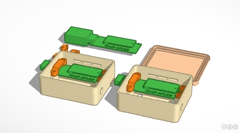
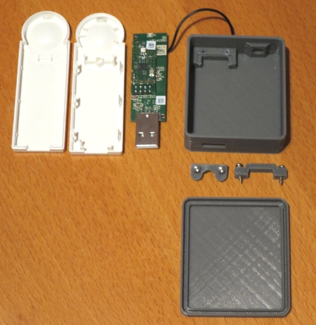
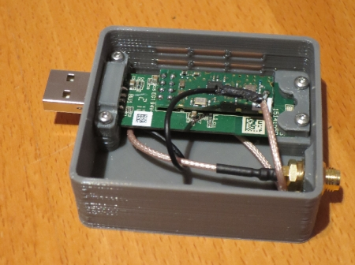
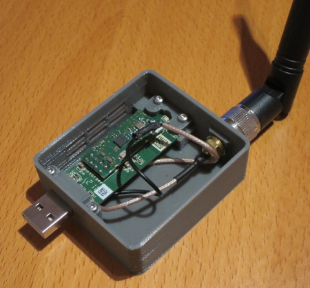
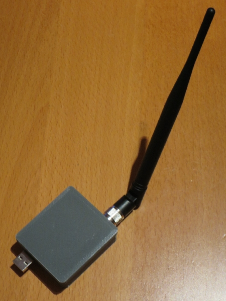

# WW-my3DP - HmIP-RFUSB (eQ3-Version) mit externer Antenne

[Zurück zur Übersicht ...](../README.md)

### Beschreibung
Gehäuse für die Platine des USB-Stick 'HmIP-RFUSB' von eQ3 und externer Antenne zum Betrieb von funkgebundenen Homematic Geräten.
  

### STL-Dateien
- [Download ...](./bin/3DP_STL_HmIP-RFUSB_20230112.zip)

### Thingiverse
- [Thing 5785914 ...](https://www.thingiverse.com/thing:5785914)

### Bilder
- Übersicht - Konstruktion
  

  
- Teile-Übersicht
  

  
  - Platine des USB-Stick 'HmIP-RFUSB'
  - Eightwood 868 MHz Antenne Kipp-und-Schwenkbar NFC RFID Antenne RP-SMA Stecker + RP-SMA Buchse Pigtail Kabel RG178 15cm 6inch für GSM Wireless WiFi
  - zwei 'Blechschrauben DIN 7981 TX Edelstahl VA Linsenkopf 2,2 x 9,5 mm' zur Befestigung des Modul-Halters (vorne)
  - zwei 'Blechschrauben DIN 7981 TX Edelstahl VA Linsenkopf 2,2 x 6,5 mm' zur Befestigung des Modul-Halters (hinten)
  - Gehäuse ohne und mit Aufhanglochung der Hinterwand
  
- Platinen Einbau
    
  
    
  
    
  - Auslöten des Original Antennendrahtes von der USB-Platine.
  - Original Antennendraht an USB-Gehäuse (Masse) auf Platinenunterseite anlöten.
  - Pigtailkabel an Antennenausgang der Platine anlöten - alten Antennendraht (USB Masse) mit Schirmung des Pigtailkabels verlöten.
  - USB-Platine und Pigtailkabel in das Gehäuse einsetzen und verschrauben.
    
- Fertiges Gerät
  

  
- Tipp
  
Um Funkstörungen zu vermeiden, sollte das Gehäuse mit einem langen (2 - 3 m) USB Verlängerungskabel vom Virtualisierungshost abgesetzt und zusätzlich auch noch ein vorgelagerter [USB Entstörfilter](https://de.retail.elv.com/elv-usb-entstoerfilter-usb-ef1-komplettbausatz-152745) eingesetzt werden:

### Historie
- 2023-01-13 - Erstveröffentlichung
