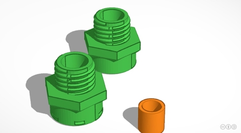
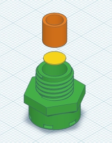
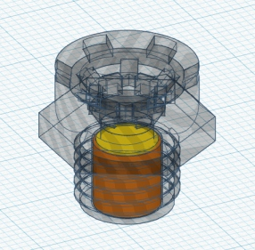

# WW-my3DP - OBO Toolbox

[Zurück zur Übersicht ...](../README.md)

#### Beschreibung

Die OBO Toolbox dient als Grundlage für unterschiedliche IOT-Projekte, bei denen es darauf ankommt, die Elektronik wirksam vor den Außeneinflüßen zu schützen. Es kommen dabei drei Modelle des 'Kabelabzweigkasten T' der Firma 'OBO Betterman' zum Einsatz, die m.E. besonders für den Außeneinsatz - z.B. im Garten - geeignet sind (IP66 und UV-beständig), da sie eine gute Langzeitstabilität aufweisen.

Für die Modelle T40, T60 und T100 wurden an das jeweilige Gehäuse angepaßte Grundplatten konstruiert. Damit ist es möglich mit Hilfe eines 3D-Druckers seine eigenen Befestigungen auf der Grundplatte unterzubringen oder zu erweitern ([Beispiel siehe hier ...](https://github.com/wolwin/WW-my3DP/blob/master/3DP_OBO_T40_HB/README.md)).

Wesentliches Merkmal für alle Modelle sind jedoch die Schrauverbinder. Sie stellen die mechanische Verbindung vom T-Gehäuse zu unterschiedlichen externen Objekten her - das geht vom kleinen 'Sensor-Housing' bis zur großen Wetterkappe.

Da Elektronik im Außenbereich 'atmen' sollte (wg. Kondenswasserbildung) kann man entweder kommerzielle Entlüftungen vorsehen (z.B.: 'Wiska EVSP 12 Druckausgleichselement M12' - EAN: 2050001453440) oder mit Hilfe einer PTFE Druckausgleichsmembran DAM-AD (B+B Sensors - Druckausgleich-Membran Ø6,7/5,3 - Art.Nr.: SHOP DAM-AD7) eine selbstgebaute Variante einsetzen.

#### OBO - Produktbeschreibungen
- OBO Kabelabzweigkasten T - [Download ...](./bin/OBO_Kabelabzweigkasten_T.zip)

#### STL-Dateien
- OBO T40 Grundplatte - [Download ...](./bin/OBO_T40_20200103.zip)
- OBO T60 Grundplatte - [Download ...](./bin/OBO_T60_20200103.zip)
- OBO T100 Grundplatte - [Download ...](./bin/OBO_T100_20200103.zip)
- Schraubverbinder M10 M12 M16 - [Download ...](./bin/OBO_Screws_20200605.zip)
- PTFE Ventilationsschraube M10 - [Download ...](./bin/OBO_Screws_Ventilation_20200605.zip)
- OBO SensorHousing - [Download ...](./bin/OBO_SensorHousing_20200103.zip)

#### Bilder
- Übersicht - Konstruktion OBO T40
  

  
- Übersicht - Konstruktion OBO T60
  

  
- Übersicht - Konstruktion OBO T100
  

  
- Übersicht - Konstruktion OBO Schraubverbinder
  

  
- Übersicht - Konstruktion PTFE Ventilationsschraube / Blindstopfen M10
  

  
- Übersicht - Konstruktion OBO SensorHousing
  

#### Historie
- 2020-06-05 - Update und Erweiterung
  - Version 1.1 - 06-2020
- 2020-01-10 - Erstveröffentlichung
  - Version 1.0 - 12-2019
