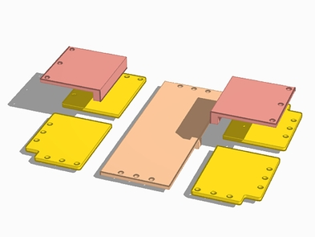
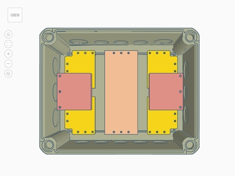
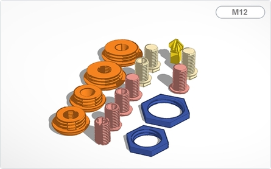

# WW-my3DP - OBO Toolbox

[Zurück zur Übersicht ...](../README.md)

### Beschreibung
Die OBO Toolbox dient als Grundlage für unterschiedliche IOT-Projekte, bei denen es darauf ankommt, die Elektronik wirksam vor den Außeneinflüßen zu schützen. Es kommen dabei drei Modelle des 'Kabelabzweigkasten T' der Firma 'OBO Betterman' zum Einsatz, die m.E. besonders für den Außeneinsatz - z.B. im Garten - geeignet sind (IP66 und UV-beständig), da sie eine gute Langzeitstabilität aufweisen.

Für die Modelle T40, T60. T100, T160 und T250 wurden an das jeweilige Gehäuse angepaßte Grundplatten konstruiert. Damit ist es möglich mit Hilfe eines 3D-Druckers seine eigenen Befestigungen auf der Grundplatte unterzubringen oder zu erweitern ([Beispiel siehe hier ...](https://github.com/wolwin/WW-my3DP/blob/master/3DP_OBO_T40_HB/README.md)).

Während die Grundplatte für das Modell T40 steckbar ist, werden für die Modelle T60, T100, T160 und T250 noch 'Blechschrauben DIN 7981 TX Edelstahl VA Linsenkopf 3,5 x 9,5 mm' zur Befestigung benötigt.

Wesentliches Merkmal für alle Modelle sind jedoch die Schrauverbinder. Sie stellen die mechanische Verbindung vom T-Gehäuse zu unterschiedlichen externen Objekten her - das geht vom kleinen 'Sensor-Housing' bis zur großen Wetterkappe.

Da Elektronik im Außenbereich 'atmen' sollte (wg. Kondenswasserbildung) kann man entweder kommerzielle Entlüftungen vorsehen (z.B.: 'Wiska EVSP 12 Druckausgleichselement M12' - EAN: 2050001453440) oder mit Hilfe einer PTFE Druckausgleichsmembran DAM-AD (B+B Sensors - Druckausgleich-Membran - Details siehe unten) eine selbstgebaute Variante einsetzen.

### OBO - Produktbeschreibungen
- OBO Bettermann T25 - EAN 4012195246770
- OBO Bettermann T40 - EAN 4012195246756
- OBO Bettermann T60 - EAN 4012195246787
- OBO Bettermann T100 - EAN 4012195246794
- OBO Bettermann T160 - EAN 4012195246800
- OBO Bettermann T250 - EAN 4012195246817
- OBO Bettermann T350 - EAN 4012195246824
  
- OBO Kabelabzweigkasten T - [Download ...](./bin/OBO_Kabelabzweigkasten_T.zip)

### STL-Dateien
- OBO T40 Grundplatte - [Download ...](./bin/OBO_T40_20200103.zip)
- OBO T60 Grundplatte - [Download ...](./bin/OBO_T60_20200103.zip)
- OBO T100 Grundplatte - [Download ...](./bin/OBO_T100_20200103.zip)
- OBO T160 Grundplatte - [Download ...](./bin/OBO_T160_20231016.zip)
- OBO T250 Grundplatte - [Download ...](./bin/OBO_T250_20231016.zip)
- Schraubverbinder M10 M12 M16 M18 M20 - [Download ...](./bin/OBO_Screws_20240611.zip)
- PTFE Ventilationsschraube M10 M12 - [Download ...](./bin/OBO_Screws_Ventilation_20231016.zip)
- OBO SensorHousing - [Download ...](./bin/OBO_SensorHousing_20200103.zip)

### 3D-Druckparameter
- CURA 3D-Druckparameter für 'OBO Toolbox' - [Download ...](./bin/OBO_PrintParameter_20200617.zip)

### Thingiverse
- [Thing 4520450 ...](https://www.thingiverse.com/thing:4520450)

### Übersicht - Konstruktion OBO T40

### Übersicht - Konstruktion OBO T60

### Übersicht - Konstruktion OBO T100

### Übersicht - Konstruktion OBO T160

### Übersicht - Konstruktion OBO T250

### Übersicht - Konstruktion OBO Schraubverbinder

### Übersicht - Konstruktion PTFE Ventilationsschraube / Blindstopfen M10 und M12

  - Montage Ventilationsschraube mit Druckausgleich-Membran
    - B+B Sensors - Druckausgleich-Membran Ø6,7/5,3 VPE - Art. Nr.: SHOP DAM-AD7
    - B+B Sensors - Druckausgleich-Membran Ø10,2/5,5 VPE - Art. Nr.: SHOP DAM-AD10
    - B+B Sensors - Druckausgleich-Membran Ø12,7/7,1 VPE - Art. Nr.: SHOP DAM-AD12
    
  
    
  - Vergleich: professionelles Druckausgleichelement (rechts)
    - Wiska EVSP 12 Druckausgleichselement M12 Polyamid Lichtgrau - EAN 2050001453440
    
  

### Übersicht - Konstruktion OBO SensorHousing

### Bilder
- Gehäuse OBO T40
    
  
    
- Gehäuse OBO T40 mit Grundplatte
    
  
    
- Gehäuse OBO T60
    
  
    
- Gehäuse OBO T60 mit Grundplatte
    
  
    
- Gehäuse O10O T60
    
  
    
- Gehäuse OBO T100 mit Grundplatten
    
  
    
- Gehäuse OBO T60 mit einer Auswahl von Schraubverbindern und M10 bzw. M12 Kabeldurchführungen
    
  
    
- Gehäuse OBO T60 mit einer Kombination von Schraubverbindern und M10 bzw. M12 Kabeldurchführungen
    
  
    
- Gehäuse OBO T60 mit M10 Schraubverbinder und Kabeldurchführung (außen)
    
  
    
- Gehäuse OBO T60 mit M10 Schraubverbinder und Kabeldurchführung (innen)
    
  
    
- Gehäuse OBO T60 mit M10 Schraubverbinder und SensorHousing (Befestigung oben)
    
  
    
- Gehäuse OBO T60 mit M10 Schraubverbinder und SensorHousing - Befestigung
    
  
    
- Gehäuse OBO T60 mit Grundplatte, Schraubverbinder und SensorHousing (Befestigung oben)
    
  
    
- Gehäuse OBO T60 mit M10 Schraubverbinder und SensorHousing (Befestigung hinten)
    
  
    
- Gehäuse OBO T60 mit Grundplatte, Schraubverbinder und SensorHousing (Befestigung hinten)
    
  
    
- Gehäuse OBO T40 mit Grundplatte, zwei Schraubverbindern für SensorHousing  (Befestigung hinten) und Kabeldurchführung (außen)
    
  
    
- Gehäuse OBO T40 mit Grundplatte, zwei Schraubverbindern für SensorHousing (Befestigung hinten) und Kabeldurchführung (innen)
    
  
    
- Sensorhalterung für SensorHousing (Verbindung über Präzisionssokel)
    
  
    
- Einschub von einer Sensorhalterung im SensorHousing
    
  
    
- Einschub von zwei Sensorhalterungen im SensorHousing (BME280 im Präzisionssockel)
    
  
    
- Einschub von zwei Sensorhalterungen (gedreht) im SensorHousing
    
  

### Historie
- 2023-10-16 - Version 1.3 - 10-2023
  - Erweiterung für OBO T160 und OBO T250
  - Update Schraubverbinder M10 M12 M16
  - Update Ventilationsschrauben M10 und M12
  - Textanpassungen
- 2020-07-04 - Bilder hinzugefügt
- 2020-06-23 - Erweiterung Schraubverbinder M10 M12 M16
  - Version 1.2 - 06-2020
- 2020-06-05 - Update und Erweiterung
  - Version 1.1 - 06-2020
- 2020-01-10 - Erstveröffentlichung
  - Version 1.0 - 12-2019
