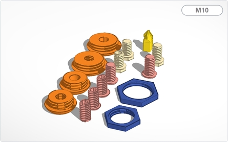
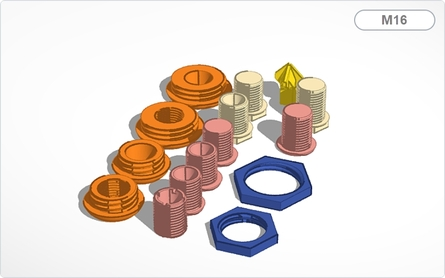

# WW-my3DP - OBO Toolbox

[Zurück zur Übersicht ...](../README.md)

#### Beschreibung

OBO Toolbox

#### STL-Dateien
- OBO T40 Grundplatte - [Download ...](./bin/OBO_T40_20200103.zip)
- OBO T60 Grundplatte - [Download ...](./bin/OBO_T60_20200103.zip)
- OBO T100 Grundplatte - [Download ...](./bin/OBO_T100_20200103.zip)
- OBO Schraubverbinder - [Download ...](./bin/OBO_Screws_20200103.zip)
- OBO SensorHousing - [Download ...](./bin/OBO_SensorHousing_20200103.zip)

#### Bilder
- Übersicht - Konstruktion OBO T40
  

  
- Übersicht - Konstruktion OBO T60
  

  
- Übersicht - Konstruktion OBO T100
  

  
- Übersicht - Konstruktion OBO Schraubverbinder
  

  
- Übersicht - Konstruktion OBO SensorHousing
  

#### Historie
- 2020-01-10 - Erstveröffentlichung
  - Version 1.0 - 12-2019
