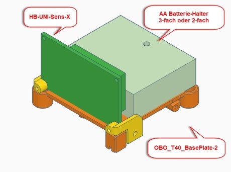
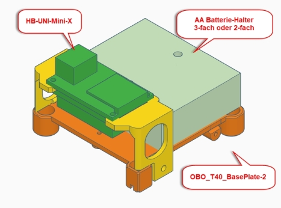
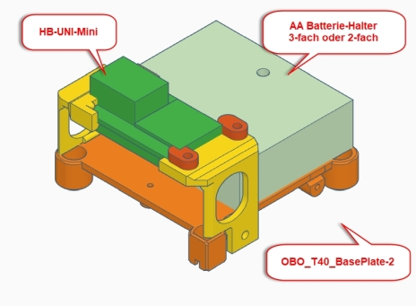
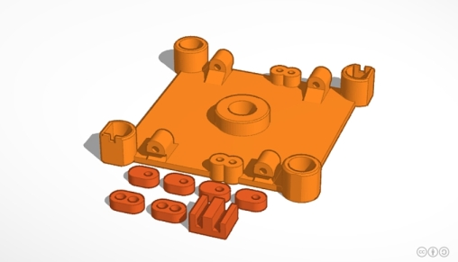
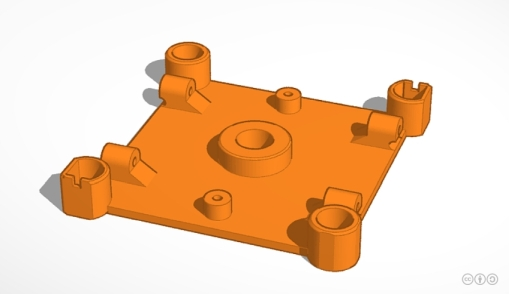
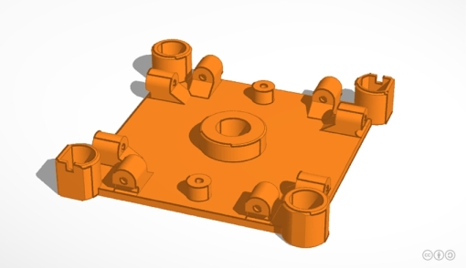
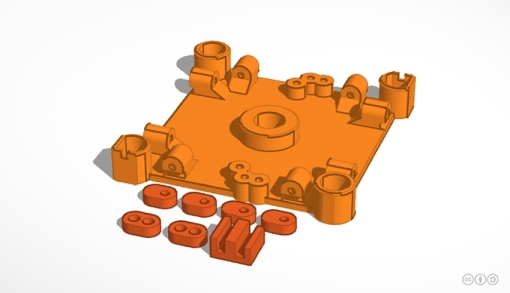
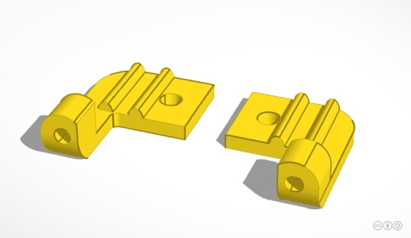
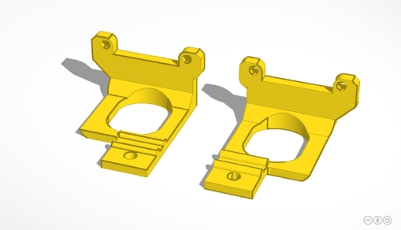
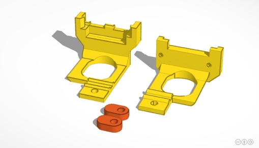

# WW-my3DP - OBO T40 für 'HB HomeBrew' Platinen

[Zurück zur Übersicht ...](../README.md)

#### Beschreibung

OBO Toolbox - OBO T40 für 'HB HomeBrew' Platinen

#### STL-Dateien
- OBO T40 für 'HB HomeBrew' Platinen - [Download ...](./bin/OBO_T40_HB_20200305.zip)

#### Bilder
- Übersicht - OBO T40 für 'HB HomeBrew' Platinen
  

  
- Übersicht - OBO T40 für 'HB HomeBrew' Platinen (mit Sensor-Platine 'Sens-Gar-118x')
  

  
- STL Teile Übersicht - OBO T40 für 'HB HomeBrew' Platinen
  

#### Historie
- 2020-03-05 - Komplett-Update der STL 3D-Print Dateien
  - Version 1.1 - 03-2020
- 2020-01-10 - Erstveröffentlichung
  - Version 1.0 - 12-2019
