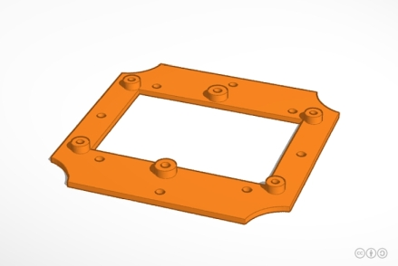
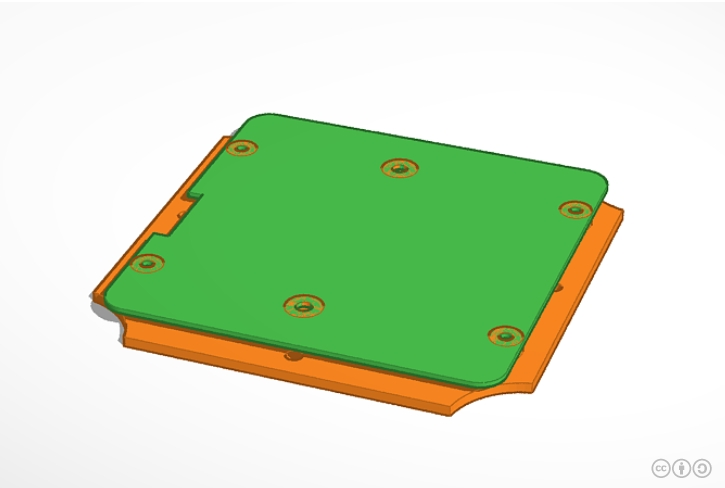
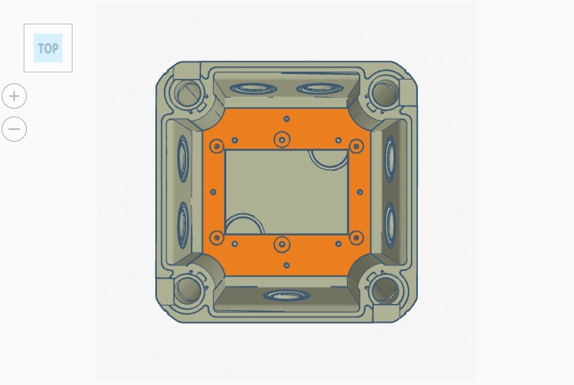
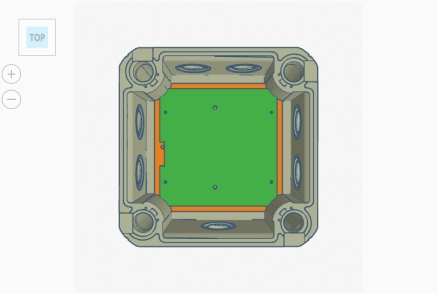
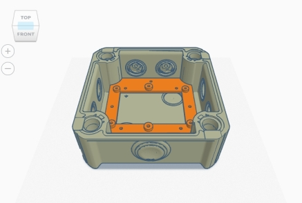
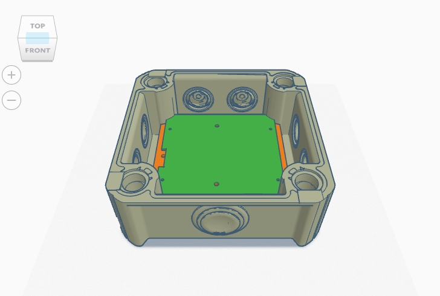
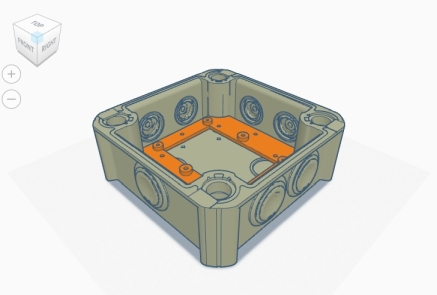
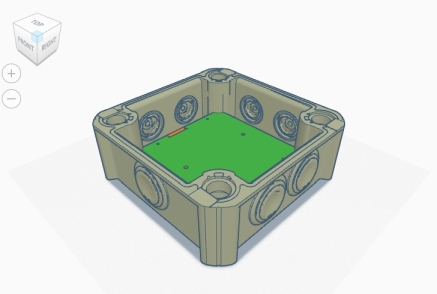

# WW-my3DP - OBO T60 für 'HM-UNI-SENS-BATT' Platine

[Zurück zur Übersicht ...](../README.md)

#### Beschreibung

OBO Toolbox - OBO T60 für 'HM-UNI-SENS-BATT' Platine  _...  (Beschreibung folgt in Kürze ...)_

#### STL-Dateien
- OBO T60 Grundplatte für 'HM-UNI-SENS-BATT' - [Download ...](./bin/OBO_T60_HM-UNI-SENS-BATT_20200103.zip)

#### Bilder
- Übersicht - Konstruktion OBO T60 für 'HM-UNI-SENS-BATT' Platine
  

#### Historie
- 2020-01-10 - Erstveröffentlichung
  - Version 1.0 - 12-2019
