# WW-my3DP - Gehäuse-Erweiterungen der Wetterstation 'STALL-Weatherman'

[Zurück zur Übersicht ... ](../README.md)

### Beschreibung
Gehäuse-Erweiterungen der Selbstbau-Wetterstation 'STALL-Weatherman' für die Hausautomation von Dr. Stall.
  
[Projekt zeigen ...](https://github.com/wolwin/WW-mySHP/blob/master/SHP_Weatherman/README.md)

<b>Stage 0</b> - Grundplatten zur mechanischen Befestigung des 'STALL-Weatherman' in den RND-Gehäusen 'RND 455-00223' und 'RND 455-00144' bzw. den OBO-Gehäusen 'OBO-T40' und 'OBO-T60'

<b>Stage 1</b> - 'STALL-Weatherman' im RND-Gehäuse ('RND 455-00223' oder 'RND 455-00144') mit abgesetztem AddOn Gehäuse für Lichtsensor BH1750 / NTC und Regensensor

<b>Stage 2</b> - 'STALL-Weatherman' im OBO-Gehäuse mit separaten Gehäusen für Lichtsensor BH1750 / NTC und Regensensor

<b>Stage 3</b> - 'STALL-Weatherman' im OBO-Gehäuse und Wetterkappe aus der 'YAWS-Toolbox' mit der 'STALL-Weatherman' Option

### STL-Dateien
- _Stage 0_
  - Grundplatten für 'STALL-Weatherman' - [Download ...](./bin/3DP_STL_WM_Baseplate_20200616.zip)
- _Stage 1_
  - AddOn Gehäuse für RND - [Download ...](./bin/3DP_STL_WM_RND-Case_20200604.zip)
- _Stage 2_
  - externes Gehäuse für Lichtsensor - [Download ...](./bin/3DP_STL_WM_SensCase_20200604.zip)
  - externes Gehäuse für Regensensor - [Download ...](./bin/3DP_STL_WM_RainCase_20200617.zip)
- _Stage 3_
  - siehe 'YAWS-Tooolbox' - ['STALL-Weatherman'-Option](https://github.com/wolwin/WW-my3DP/blob/master/3DP_YAWS/README.md#stl-dateien)

### 3D-Druckparameter
- CURA 3D-Druckparameter für 'STALL-Weatherman' - [Download ...](./bin/3DP_STL_WM_PrintParameter_20200617.zip)

### Thingiverse
- [Thing 4523028 ...](https://www.thingiverse.com/thing:4523028)

### Material
- Benutzte Materialien: 
  - 3D Druckmaterial: ANYCUBIC PLA+, weiß
  - HORNBACH Buntlack PU Acryllack glänzend glacierweiß 125 ml - EAN 4306517157760
  - LUGATO Wetterschutz-Slicon (transparent) WIE GUMMI 310 ml - EAN 4009071098233
  - Blechschrauben DIN 7981 TX Edelstahl VA Linsenkopf 2,2 x 9,5 mm
  - Blechschrauben DIN 7981 TX Edelstahl VA Linsenkopf 2,9 x 9,5 mm
  - Präzisionsbuchsenleiste - Rastermaß 2,54 mm
  - Wiska EVSP 12 Druckausgleichselement M12 Polyamid Lichtgrau - EAN 2050001453440
  - B+B Sensors - Druckausgleich-Membran Ø6,7/5,3 VPE - Art. Nr.: SHOP DAM-AD7
  - Glas: Fa. ibero - 'Kapern, Siebung Capucines' 35 g, EAN: 4013200552206 - z.B. erhältlich bei 'Edek*'
  - Dichtring 1 1/2": GEKA plus-Flachdichtungssatz je 3 Stck 40110D-40116D (1/2"-1 1/2"), Artikelnumer: 10.5000.9, EAN: 4015933010640 (d_a = 41,5 mm, d_i = 30,0 mm, dr = 6,0 mm, h = 2,0 mm)   
  - Kunststoff Kabelverschraubung M12 IP68
  - tesa extra Power Perfect Gewebeband 56341, 2,75 m x 19 mm, schwarz - EAN: 4042448043993

### Konfiguration und Aufbau
- <b>Stage 0</b> -  Grundplatten für 'STALL-Weatherman'
    
  -  Grundplatten für Gehäuse 'RND 455-00223' und 'RND 455-00144' - 4 Edelstahl Senkkopfschrauben M4 x 20 sind im Weatherman Bausatz enthalten
    
  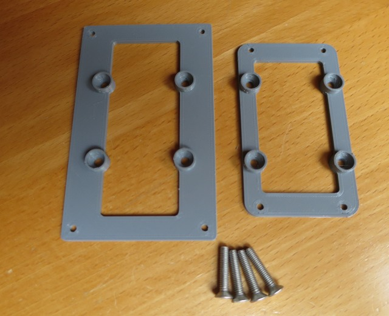
    
  -  Gehäuse 'RND 455-00223' - 4 Edelstahl Senkkopfschrauben M4 x 20 mit Muttern sind im Weatherman Bausatz enthalten - benötigt werden noch 4 Schrauben M3 x 6 zur Befestigung der Grundplatte - mit den Distanzhülsen (6 mm, 8 mm, 10 mm) wird die Höhe der Weatherman Platine im Gehäuse festgelegt
    
  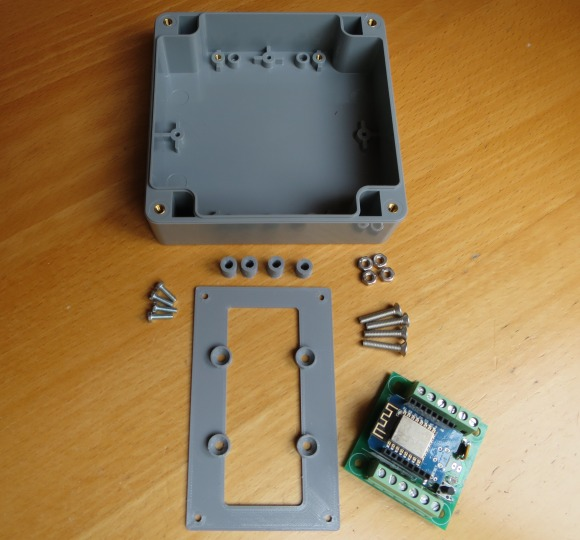
    
  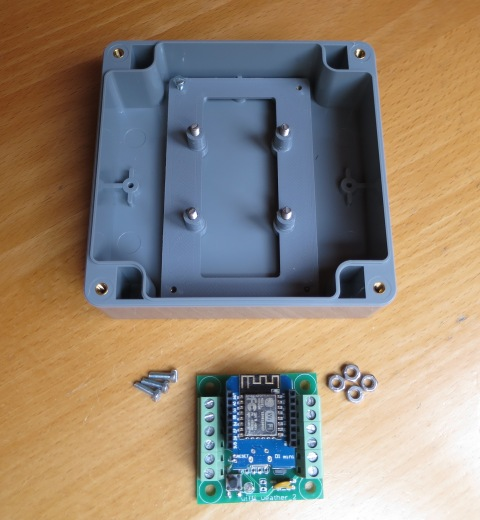
    
  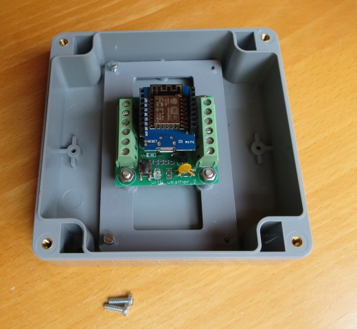
    
  -  Gehäuse 'OBO T60' - 4 Edelstahl Senkkopfschrauben M4 x 20 mit Muttern sind im Weatherman Bausatz enthalten - benötigt werden noch 4 'Blechschrauben DIN 7981 TX Edelstahl VA Linsenkopf 3,5 x 9,5 mm' zur Befestigung der Grundplatte - mit den Distanzhülsen (6 mm, 8 mm, 10 mm) wird die Höhe der Weatherman Platine im Gehäuse festgelegt
    
  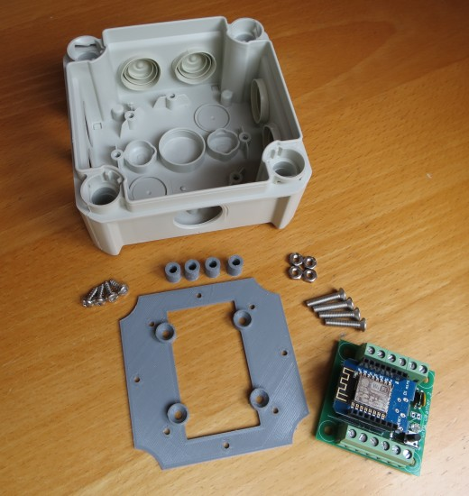
    
  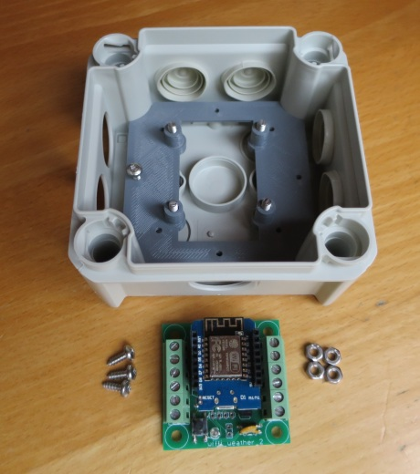
    
  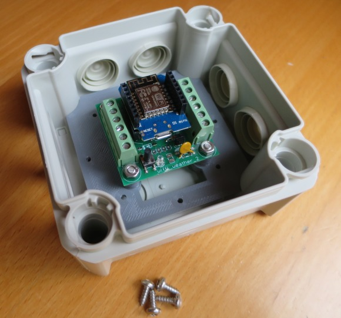
    
  -  Gehäuse 'OBO T40' - 4 Edelstahl Senkkopfschrauben M4 x 20 mit Muttern sind im Weatherman Bausatz enthalten - mit den Distanzhülsen (6 mm, 8 mm, 10 mm) wird die Höhe der Weatherman Platine im Gehäuse festgelegt
    
  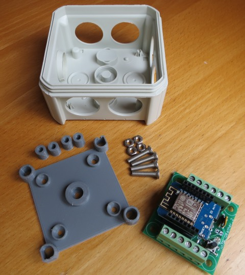
    
  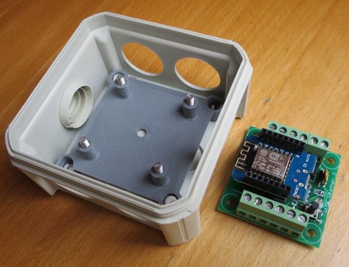
    
  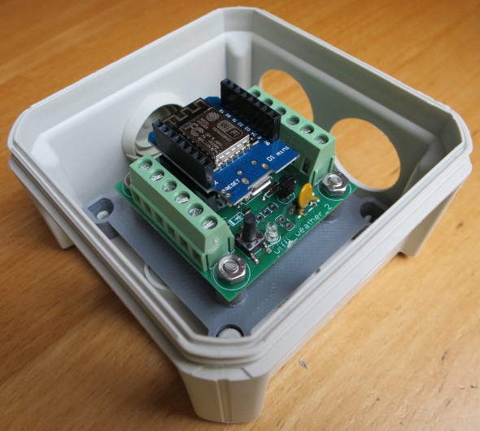
    
- <b>Stage 1</b> -  Gehäuse für RND
    
  - Gemeinsames Gehäuse für Lichtsensor, NTC, Licht- und Regensensor
    - Der Aufbau entspricht im Detail den Einzelgehäusen - siehe Stage 2.
    
- <b>Stage 2</b> -  Gehäuse für Licht- und Regensensor
    
  - Gehäuse für Lichtsensor und NTC
    
  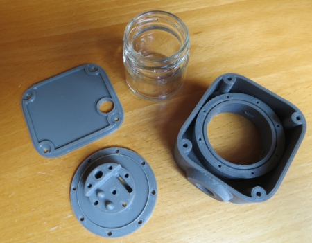
    
    - Glas: Fa. ibero - 'Kapern, Siebung Capucines' 35 g, EAN: 4013200552206 - z.B. erhältlich bei 'Edek*'
      
    
    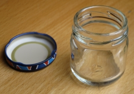
      
    - Dichtring 1 1/2": GEKA plus-Flachdichtungssatz je 3 Stck 40110D-40116D (1/2"-1 1/2"), Artikelnumer: 10.5000.9, EAN: 4015933010640 (d_a = 41,5 mm, d_i = 30,0 mm, dr = 6,0 mm, h = 2,0 mm)
      
    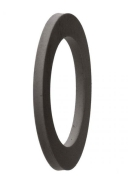
      
    - Sensorhalter ohne Dichtring (weiß - wird mit Silikon eingesetzt) oder Sensorhalter mit Dichtring (grau)
      
    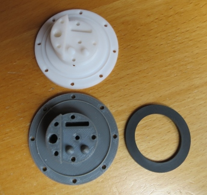
      
    - Sensorhalter mit 4-fach Präzisionsbuchsenleiste, Sensor BH1750, NTC 10k, Abdeckkappe
      
    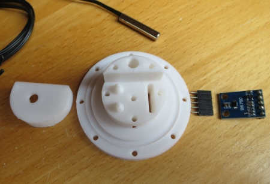
      
    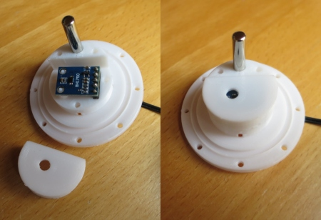
      
    - Anpassen des Anschlusses von Glas und Gehäuse durch vorsichtiges Anschleifen der oberen Gehäusekante mit einer Halbrundfeile - das Eindrehen des Glases in das Gehäuse muß schwergängig bleiben (beim endgültigen Einbau wird das Glas dick mit UV-beständigem Silikon eingesetzt, wodurch es dann leichtgängig wird) - das Glas muß sich so weit eindrehen lassen (1/8 Drehung), dass die Haltenasen bis zu den Endpositionen gehen - siehe Pfeil)
      
    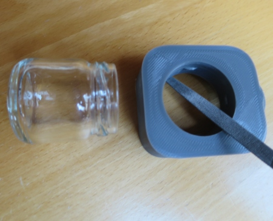
      
    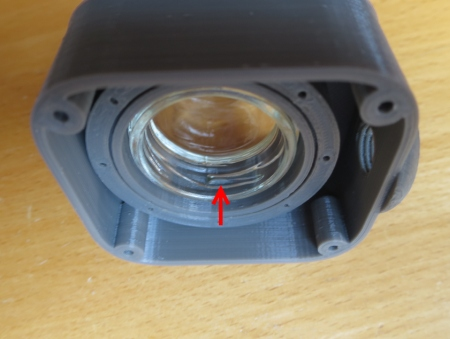
      
    - Einsetzen des Dichtrings für den 'Sensorhalter mit Dichtring' - für den 'Sensorhalter ohne Dichtring' erfolgt die Montage mit Silikon
      
    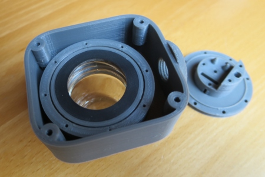
      
    - Fixieren des Sensorhalters mit 8 'Blechschrauben DIN 7981 TX Edelstahl VA Linsenkopf 2,2 x 9,5 mm' - der Gehäusedeckel wird mit 4 'Blechschrauben DIN 7981 TX Edelstahl VA Linsenkopf 2,9 x 9,5 mm' verschraubt. Alle Dichtflächen und auch die Lüftungsschraube werden zusätzlich beim Einbau dünn mit Silikon versehen.
      
    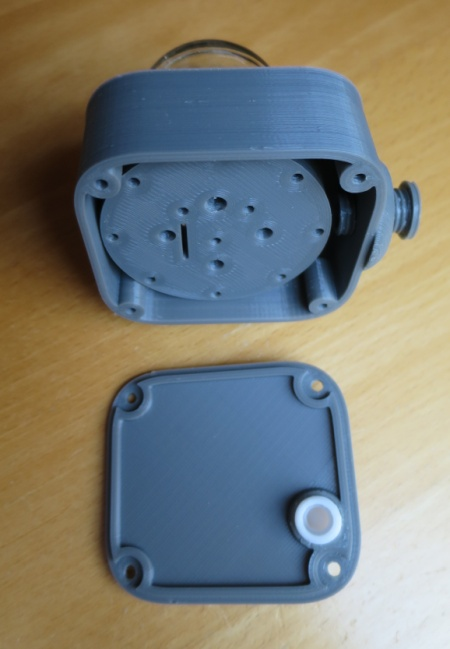
      
    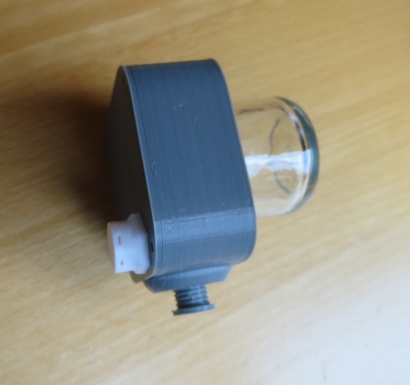
    
  - Gehäuse für Regensensor (hier: noch ohne Lüftungsschraube)
    
  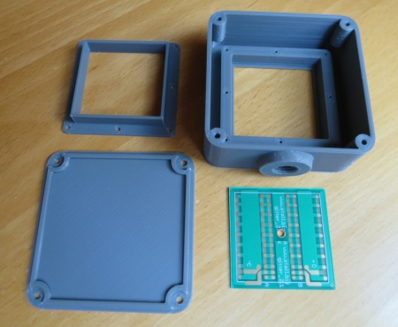
    
    - Anpassen von Platine und Gehäuse - die Platine muß bündig an allen vier Ecken auf dem Gehäuserand aufliegen - siehe Pfeile. Dazu ist es evtl. notwendig am Gehäuse die Ecken zu bereinigen ('eckig zu machen') und / oder die Platine mit einer Feile zu entgraten.
      
    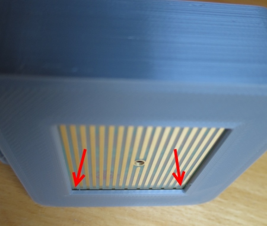
      
    - Fixieren des Platinenhalters mit 8 'Blechschrauben DIN 7981 TX Edelstahl VA Linsenkopf 2,2 x 9,5 mm (beim endgültigen Einbau wird Platine und Halter mit UV-beständigem Silikon eingesetzt)
      
    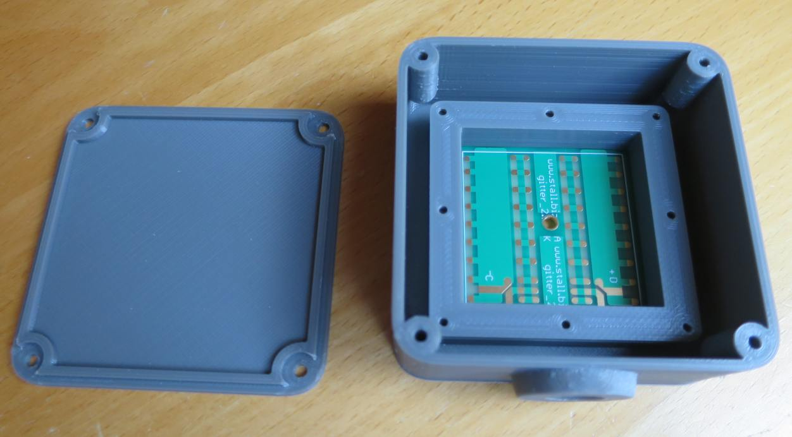
      
    - Der Gehäusedeckel wird mit 4 'Blechschrauben DIN 7981 TX Edelstahl VA Linsenkopf 2,9 x 9,5 mm' verschraubt. Alle Dichtflächen und auch die Lüftungsschraube im Deckel werden zusätzlich beim Einbau dünn mit Silikon versehen.
      
- <b>Stage 3</b> -  OBO-Gehäuse und Wetterkappe aus der 'YAWS-Toolbox' mit der 'STALL-Weatherman' Option
      
    - Befestigungen für Gehäuse 'OBO-T60' und YAWS-Halterung 'YAWS_V3_Holder-WM_60' für die YAWS-Wetterkappe
      
    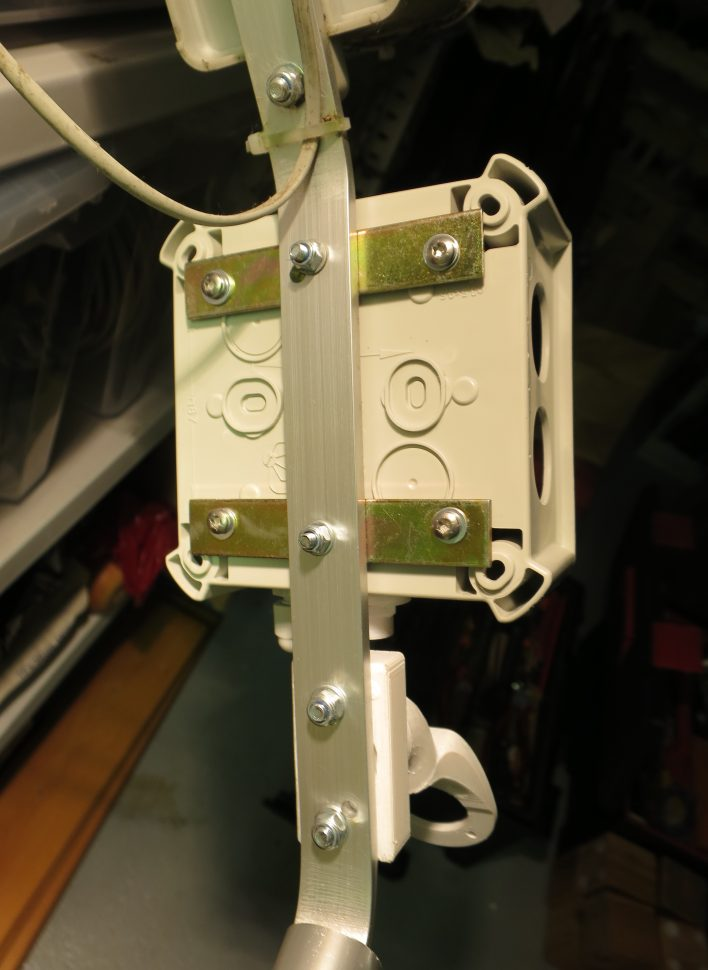
      
    - Weatherman-Platine im 'OBO-T60' Gehäuse (siehe auch oben) - drei seitliche Kunststoff Kabelverschraubung (links und rechts) für die Zuleitung der Sensorkabel
    - Stromversorgung über Kunststoff Kabelverschraubung (oben links)
    - Wiska EVSP 12 Druckausgleichselement (mittig oben)
      
    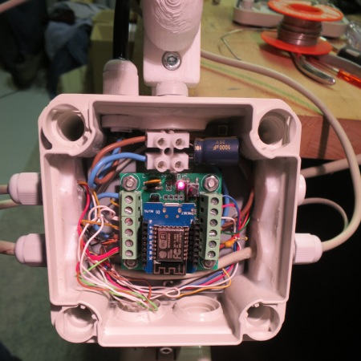
      
    - Deckel 'OBO-T60' mit dünner Dämmung - nach dem Verschließen des Gehäuses, wird die Dichtfuge des 'OBO-T60' Gehäuses mit 'tesa extra Power Perfect Gewebeband' abgedeckt.
      
    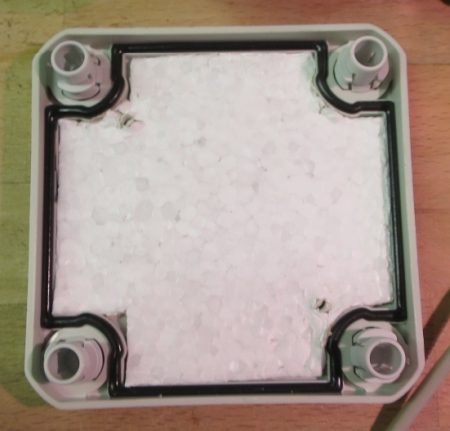
      
    - Weatherman - Stage 3 - Version 06-2020
      
    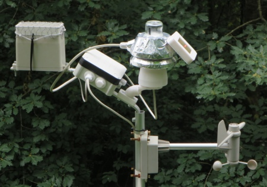

### Historie
- 2020-06-30 - Dokumentation
- 2020-06-17 - Fix STL-Dateien RainCase
- 2020-06-16 - Stage 0 - Grundplatten und STL-Dateien
- 2020-06-08 - Erstveröffentlichung
