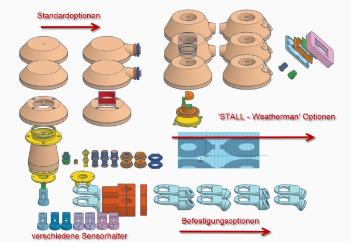
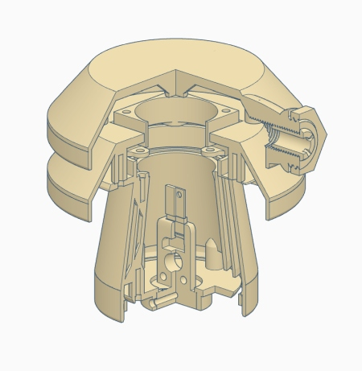
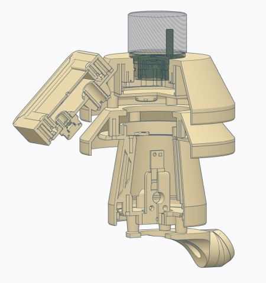

# WW-my3DP - YAWS - Yet Another Weather Shield - Version 3 - Toolbox

[Zurück zur Übersicht ...](../README.md)

#### Beschreibung
xxx

#### STL-Dateien

#### Bilder
- Übersicht - YAWS
  

  
- YAWS - Standard-Konfiguration mit 40 mm Lüfteroption
  

  
- YAWS - 'STALL-Weatherman'- Konfiguration mit Fußhalter
  

#### Historie
- 2020-06-05 - Erstveröffentlichung
  - Version 1.0 - 06-2020
