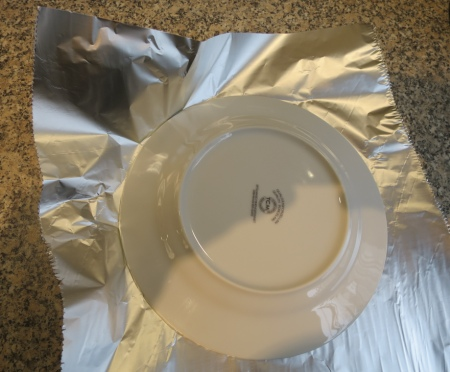
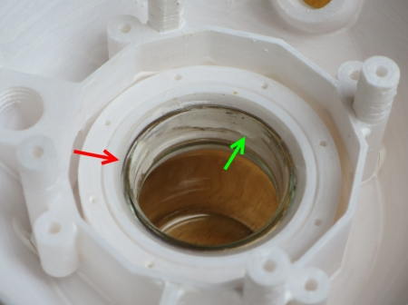
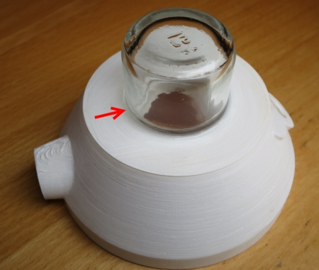
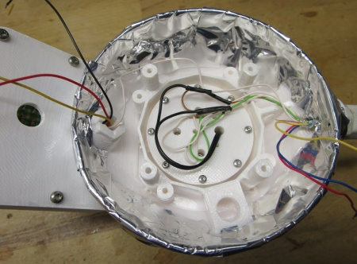
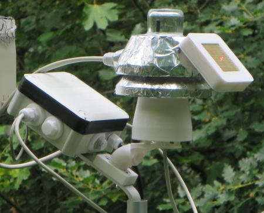

# WW-my3DP - YAWS - Yet Another Weather Shield - Toolbox - Version 3

[Zurück zur Übersicht ...](../README.md)

#### Beschreibung
Toolbox für eine universielle Wetterkappe mit vielfältigen Kombinationsmöglichkeiten.
  
[Projekt zeigen ...](https://github.com/wolwin/WW-mySHP/blob/master/SHP_YAWS/README.md)

#### Übersicht - 'YAWS-Toolbox'
 
  

#### STL-Dateien
- 'YAWS-Toolbox - V3' - [Download ...](./bin/3DP_STL_YAWS_V3_20200630.zip)
- 'STALL-Weatherman'-Option für 'YAWS-Toolbox - V3' - [Download ...](./bin/3DP_STL_YAWS_V3_WM_20200630.zip)
- siehe 'OBO-Tooolbox' - ['Schraubverbinder M10 M12 M16' und 'PTFE Ventilationsschraube M10'](https://github.com/wolwin/WW-my3DP/blob/master/3DP_OBO/README.md#stl-dateien)

### 3D-Druckparameter
... _folgt in Kürze_

#### Thingiverse
xxx

#### Material
- Benutzte Materialien: 
  - 3D Druckmaterial: ANYCUBIC PLA+, weiß
  - HORNBACH Buntlack PU Acryllack glänzend glacierweiß 125 ml - EAN 4306517157760
  - LUGATO Wetterschutz-Slicon (transparent) WIE GUMMI 310 ml - EAN 4009071098233
  - TESA Insect Stop - Standard 1,00 x 1,00 m - ArtNr 55670-00020 - EAN: 4042448059239
  - Blechschrauben DIN 7981 TX Edelstahl VA Linsenkopf 2,2 x 9,5 mm
  - Blechschrauben DIN 7981 TX Edelstahl VA Linsenkopf 2,9 x 9,5 mm
  - PTFE-Gewindedichtband 0,10 mm - EAN 4001845517926
  - Präzisionsbuchsenleiste - Rastermaß 2,54 mm
  - Winkel 120 x 55 x 17 mm - EAN 4004338333959
  - Rohrschelle 28 mm für 3/4'' - EAN 4004338216634
  - 40 mm Lüfter NOCTUA NF-A4x10 (5V) - EAN	4716123315469
  - Wiska EVSP 12 Druckausgleichselement M12 Polyamid Lichtgrau - EAN 2050001453440
  - B+B Sensors - Druckausgleich-Membran Ø6,7/5,3 VPE - Art. Nr.: SHOP DAM-AD7
  - Haushalts-Alufolie
  - Alu-Klebeband
  - Glas: Fa. ibero - 'Kapern, Siebung Capucines' 35 g, EAN: 4013200552206 - z.B. erhältlich bei 'Edek*'
  - Kunststoff Kabelverschraubung M12 IP68

#### Konfiguration
- YAWS Konfiguration
    
  - Die Konfiguration der YAWS Wetterkappe erfolgt kombinatorisch über vier Ebenen:
    - Ebene 1: evtl. Befestigung unten - verschiedene Halterungen mit unterschiedlicher Neigungs- und Verbindungsoptionen
    - Ebene 2: Sensorkammer mit Insektenschutz und unterschiedlichen Sensorhaltern
    - Ebene 3: Lüftungskappe 1 - ohne und mit 40 mm Lüfter
    - Ebene 4: Lüftungskappe 2 evtl. mit Befestigungsmöglichkeit oben
  
- Beispiel YAWS Konfiguration - Ebene 1 - Halterung unten
    
  - 90° Halterung mit M16 Hohlschraube und M4 x 20 mm Befestigung an einem Metallwinkel mit Rohrschelle zur Mastbefestigung
    
  
    
  
    
  - 90° Halterungen mit M12 und M16 Hohlschrauben
    
  
    
  - Halterungen mit unterschiedlichen Neigungen (30°, 45°, 60°, 90°, 135°, 150°) für M12 und M16 Hohlschrauben
    
  
    
- Beispiel YAWS Konfiguration - Ebene 2 - Sensorkammer und Sensorhalters
    
  - Sensorhalter für zwei Kabelstärken (5mm, 7mm) und Sensoren mit unterschiedlichen Anschlüßen (1x4 Pin, 2x4 Pin, 1x6 Pin, 1x7 Pin)
    
  
    
  - Der Sensorhalter wird von unten in die Sensorkammer gesteckt - die Fixierung des Halters erfolgt mit einer 'Blechschraube DIN 7981 TX Edelstahl VA Linsenkopf 2,9 x 9,5 mm'
    
  
    
  - Sensorkammer mit Fixierringen für das Insektengitter und obere Halteplatte für die Lüftungskappen - Sensorkammer und die untere und obere Halteplatte werden mit 8 'Blechschrauben DIN 7981 TX Edelstahl VA Linsenkopf 2,9 x 9,5 mm' miteinander verschraubt
    
  
    
  
    
  
    
  
    
- Beispiel YAWS Konfiguration - Ebene 3 - Lüftungskappe 1
    
  - Standard Lüftungskappe 1 - die Pfeile zeigen auf die Aufsetz-Vertiefungen, die nach dem 3D-Druck (wd. Supportdruck) 'herausgebrochen' werden müssen.
    
  
    
  - Standard Lüftungskappe 1 für 40 mm Lüfter - hier: NOCTUA NF-A4x10 (5V)
    
  
    
- Beispiel YAWS Konfiguration - Ebene 4 - Lüftungskappe 2
    
  - Standard Lüftungskappe 2 - hier mit seitlicher Befestigungsmöglichkeit bzw. Kabelausgang - mittig in der Kappe ist auch eine verdeckte 4 mm Bohrung zur zentralen Befestigung vorgesehen. Die Lüftungskappen 1 und 2 werden mit 4 'Blechschrauben DIN 7981 TX Edelstahl VA Linsenkopf 2,9 x 9,5 mm' miteinander verbunden. Danach wird diese Einheit mit weiteren 4 'Blechschrauben DIN 7981 TX Edelstahl VA Linsenkopf 2,9 x 9,5 mm' von unten mit dem Halteplatte der Sensorkammer verschraubt.
    
  
    
- Beispiel YAWS Konfiguration - Ebene 4 - 'STALL-Weatherman'-Option
    
  - 'STALL-Weatherman'- Option für seperate Licht- und Regensensor-Gehäuse mit PTFE-Lüftungsschrauben (grau)
    
  
    
  
    
  
    
  

#### Aufbau und Inbetriebnahme
- YAWS - Aufbau allgemein
    
  -  Alle 3D-Druckteile wurden mit hochwertigem (weißem) PLA-Material gedruckt. Um eine gewisse UV- und Wasserbeständigkeit zu erreichen, wurden alle Teile VOR dem Zusammenbau mit UV-beständigem PU-Acryllack auf Wasserbasis gestrichen (siehe Materialliste).
  - Die Verwendung des UV-beständigem LUGATO Silikon erfordert Geduld: handfest wird das Silikon erst nach 24 Stunden - wirklich fest ist das Silikon nach ca. 7 Tagen Trocknung (siehe Aufdruck auf der Kartusche) - dann aber hält es ... und dichtet bei Kälte und Hitze!!
    
- YAWS - Aufbau der Sensorkammer mit Insektenschutz (Ebene 2)
    
  - Zentraler Kern des YAWS ist die Sensorkammer - sie besteht aus einer konisch nach oben zulaufenden Kammer, die von zwei Lüftungsbereichen umgeben ist - mit dem sich ergebenden Kamineffekt, soll eine Temperaturentkopplung zwischen Gehäuse und der zu messenden Umgebungstemperatur in der Sensorkammer erreicht werden.
  - Insektengitter am unteren und oberen Ende der Sensorkammer verhindert das Eindringen von Kleintieren.
  - Halterungen an der Sensorkammer unten und oben fixieren den Insektenschutz und stellen die Verbindung zum Sensorhalter und den Abdeckkappen her.
    
  
    
  - Sensorkammer unten - Insektenschutzgitter aufspannen und Sensorhalterung (hier: für YAWS Befestigungsoption unten) mit vier 'Blechschrauben DIN 7981 TX Edelstahl VA Linsenkopf 2,9 x 9,5 mm' fixieren
    
  
    
  - Sensorkammer unten - Insektenschutzgitter spannen und Spannring einsetzen
    
  
    
  - Sensorkammer unten - Spannring gleichmäßig tief eindrücken - max. bis zum Anschlag in der Sensorkammer
    
  
    
  - Sensorkammer unten - überstehendes Insektengitter am oberen Rand des Spannrings abschneiden
    
  
    
  
    
  - Sensorkammer unten - der Spannring sollte nur bei Nutzung eines Lüfters ganz bis an den Anschlag gedrückt werden - ohne Lüfter-Option sollte der Spannring bündig mit dem Sensorgehäuse abschließen
    
  
    
  - Sensorkammer unten - der Spannring schließt bündig mit dem Sensorgehäuse ab - dies ergibt einen vergrößerten Luftzutritt
    
  
    
  - Sensorkammer oben - Zwischenhalterung mit vier 'Blechschrauben DIN 7981 TX Edelstahl VA Linsenkopf 2,9 x 9,5 mm' verschrauben
    
  
    
  - Sensorkammer oben - Insektenschutzgitter aufspannen und Spannring einsetzen
    
  
    
  - Sensorkammer oben - überstehendes Insektengitter am oberen Rand des Spannrings abschneiden
    
  
    
- YAWS - Aufbau des Sensorhalters (Ebene 2)
    
  - Auswahl des Sensorhalters nach Kabelstärke und Anzahl der Sensoranschlüsse - hier für Sensor BME280: Sensorhalter mit 4-fach Präzisionsbuchsenleiste und Kabelfixierung durch Kabelbinder
    
  
    
  
    
  - hier: Sensorplatine BME280 mit PTFE-Gewindedichtband (Teflon) 1-lagig vorne und hinten umfassen, 2-te Lage unterhalb des Sensors um 90° gedreht umwickeln / fixieren. Abdichten der Steckverbindung mit Silikon.
    
  
    
  
    
- YAWS - Aufbau der Lüftungskappen (Ebene 3 und 4)
    
  - Die beiden Lüftungskappen sollten, wenn sie im Sonnenlicht stehen, mit Alufolie beklebt werden (trotzdem vorher die Kappen lackieren !!), damit möglichst viel Sonnenlicht reflektiert wird. Damit wird die Temperaturaufnahme des Gehäuses verringert. Dies kann einfach mit Haushalts-Alufolie und / oder Alu-Klebefolie erreicht werden.
    
  
    
  - Die Alufolie mit Hilfe eines Dessert-Tellers markieren und den Umring ausschneiden.
    
  
    
  
    
  - Die Alufolie mit Hilfe einer Lüftungskappe ebenfals markieren und dann die Folie 8-fach bis zur Markierung einschneiden.
    
  
    
  
    
  - Die Alufolie überlappend einschlagen und die Überlappungen mit der Alu-Klebefolie (großzügig) abdecken.
    
  
    
  
    
  
    
  - Bei der 'STALL-Weatherman'-Option genauso vorgehen.
    
  
    
  
    
  - Fertige 'STALL-Weatherman'-Option und Standard Lüftungskappe (Ebene 1)
    
  
    
- YAWS - Zusammenbau der Lüftungskappen (Ebene 3 und 4) und der fertig montierten Sensorkammer
    
  - Wie schon oben gezeigt, werden die Lüftungskappen 1 und 2 werden mit 4 'Blechschrauben DIN 7981 TX Edelstahl VA Linsenkopf 2,9 x 9,5 mm' miteinander verbunden.
  - Soll eine obere zentrale Befestigung erfolgen, dann können die beiden Kappen mit einer M4 Schraube am Befestigungsort angebracht werden.
  - Danach wird die vormontierte Sensorkammer von unten mit weiteren 4 'Blechschrauben DIN 7981 TX Edelstahl VA Linsenkopf 2,9 x 9,5 mm' an den Lüftungskappen verschraubt.
  - Abschließend kann dann der vormontierte Sensorhalter in die Sensorkammer eingeschoben und mit einer 'Blechschraube DIN 7981 TX Edelstahl VA Linsenkopf 2,9 x 9,5 mm' fixiert werden.
    
  
    
  
    
- YAWS - Aufbau der 'STALL-Weatherman'-Option (Ebene 4)
    
  - Anpassen des Anschlusses von Glas und Gehäuse durch vorsichtiges Anschleifen der oberen Gehäusekante mit einer Halbrundfeile - das Eindrehen des Glases in das Gehäuse muß schwergängig bleiben.
    
  
    
  - Beim endgültigen Einbau wird das Glas dick mit UV-beständigem Silikon eingesetzt (roter Pfeil), wodurch das Eindrehen nun leichtgängig wird.
    
  
    
  - Das Glas muß sich so weit eindrehen lassen (1/8 Drehung), dass die Haltenasen bis zu den Endpositionen gehen - siehe grüner Pfeil. Der Silikon-Abschluß wird geglättet - siehe roter Pfeil.
    
  
    
  - Der Silikon-Abschluß oben wird evtl. ergänzt und ebenfalls geglättet - siehe roter Pfeil. Danach sollte man vor einer Weiterbearbeitung dem Silikon mindestens 24 Stunden zum Abbinden geben!!
    
  
    
  - Montage des Regensensors - die Regensensorplatine ist vollständig bestückt und getestet. Die LED wurde großzügig mit Silikon abgedichtet.
    
  
    
  -  Anpassen von Platine und Gehäuse - die Platine muß bündig an allen vier Ecken auf dem Gehäuserand aufliegen. Dazu ist es evtl. notwendig am Gehäuse die Ecken zu bereinigen ('eckig zu machen') und / oder die Platine mit einer Feile zu entgraten.
  - Dann wird die Innenseite des Platinenschachtes und der Halter (großzügig) mit Silikon bestrichen und die Platine eingesetzt.
    
  
    
  - Fixieren des Platinenhalters mit 8 'Blechschrauben DIN 7981 TX Edelstahl VA Linsenkopf 2,2 x 9,5 mm. Dann wird der Silikon-Abschluß an der Platinen- Gehäuse-Schnittstelle evtl. ergänzt und geglättet
    
  
    
  - Der Silikon-Abschluß auf der Sensorseite wird (evtl. ergänzt und) ebenfalls geglättet - siehe rote Pfeile.
    
  
    
  - Zuletzt wird der Deckel dünn mit Silikon eingesetzt und mit 7 'Blechschrauben DIN 7981 TX Edelstahl VA Linsenkopf 2,9 x 9,5 mm' verschraubt Danach sollte man vor einer Weiterbearbeitung dem Silikon mindestens 24 Stunden zum Abbinden geben!!
    
  
    
  
    
  - Nach dem Abbinden der Silikonabdichtungen, können alle Komponenten (Sensorträger Typ 2, Sensorkappe) und Sensoren (BH1750, NTC 10K - schwarz lackiert) zusammengebaut werden.
    
  
    
  - Der Regensensor wird mit einer OBO M12 Hohlschraube (OBO_S_M12-10_B2-M14_H) an der Kappe befestigt.
    
  
    
  - Der Sensorträger Typ 2 (YAWS_V3_Cap-2_WM-SensHolder-2) wird mit 5-poligen Präzisionssockel mit 4-poligem Anschlußkabel, BH1750 und NTC (Sekundenkleber zum Fixieren) bestückt.
  - Die Abdeckkappe (YAWS_V3_Cap-2_WM-SensHolder-Cap) wird mit 3 'Blechschrauben DIN 7981 TX Edelstahl VA Linsenkopf 2,2 x 9,5 mm' aufgesetzt.
    
  
    
  
    
  - Der Sensorträger wird eingesetzt und mit 8 'Blechschrauben DIN 7981 TX Edelstahl VA Linsenkopf 2,2 x 9,5 mm' fixiert.
    
  
    
  - Anschluß und Verbindung des Regensensors (4 Leitungen), des Helligkeitssensors BH1750 (4 Leitungen) und des NTC (2 Leitungen) an das 8-polige Zuleitungskabel  

  | **Kabel-Zuleitung Farbe** | **Kabel-Zuleitung Beschreibung** | **Ziel-Komponente** |
  | --- | --- | --- |
  |  GRÜN | Platine +3 V | BH1750 - I2C - 3,3 V - rot |
  |  WEISS-GRÜN | SCL - Platine IO05 | BH1750 - I2C - SCL - gelb |
  |  WEISS-BRAUN | SDA - Platine IO04| BH1750 - I2C - SDA - grau |
  |  BRAUN | Platine GND | (BH1750 - I2C - GND - schwarz) + (NTC + GND - schwarz) + (Regenmelder - GND - weiß) |
  |  WEISS-GELB | Platine NTC | NTC - grau |
  |  GELB | 1 nF - Platine IO13 | Regenmelder - gelb |
  |  ROT | Platine +5 V | Heizung - +5 V - rot |
  |  BLAU | Platine IO00 | Heizung - GND - blau |

  - Vor dem Verschließen des Deckels sollte das Anschlußkabel an den Weatherman angeschlossen und alle Komponenten einzeln / gemeinsam getestet werden !!
    
  
    
  - Die Abdeckung und die Leitungsdurchführungen werden mit Silikon eingesetzt und mit 4 'Blechschrauben DIN 7981 TX Edelstahl VA Linsenkopf 2,2 x 9,5 mm' festgeschraubt. Die Kabeldurchführung zum Regensensorgehäuse wird umfassend mit Silikon abgedichtet. Abschließend werden die beiden PTFE-Lüftungsschrauben leicht mit Silikon versehen und in den Regensensor und die Kappe eingeschraubt.
    
  
    
  
    
  - Mit der Montage der Lüftungskappe 1 (Ebene 2) wird die Montageeinheit komplettiert. Der weitere Zusammenbau mit der Sensorkammer und den Halterungen erfolgt, wie beschrieben.
    
  

### Bilder
- YAWS-Standard - Feinstaub-Sensor
      
    
      
- YAWS mit 'STALL-Weatherman'-Option
  

#### Historie
- 2020-06-30 - Dokumentation und Final STL-Dateien (alle)
- 2020-06-27 - Erweiterung 'STALL-Weatherman'-Option - neue WM Halterung
- 2020-06-27 - Erweiterung STL-Dateien 'YAWS-Toolbox' - Halterung verstärkt
- 2020-06-17 - Fix STL-Dateien 'STALL-Weatherman'-Option - RainCase
- 2020-06-08 - Erstveröffentlichung
